# Scaling a Payment Gateway: From 1 RPS to 1,000,000 RPS

A staged Java 21 / Spring Boot 3 architecture playbook that separates request ingestion from money movement at every scale, from a single instance handling one payment a second to a globally distributed platform absorbing a million requests a second.

## 0. Foundational Framing: Six Planes, Not One Big Loop

**"1,000,000 requests/second" is an ingestion number, not an authorization number.** A payment gateway that quotes 1M RPS is describing how fast it can *accept, validate, and durably record* incoming requests at its edge — not how many card authorizations actually clear per second. Real money movement is gated by systems the gateway does not control: card networks, issuing banks, PSPs (payment service providers), and fraud-scoring providers each publish or contractually enforce their own throughput ceilings, per-merchant rate limits, and latency budgets. A single PSP integration might sustain on the order of a few thousand authorizations per second before it starts throttling or degrading; a card network's real-time authorization rails are provisioned for large aggregate peaks but still allocate capacity per acquirer and per merchant category. No amount of Kubernetes autoscaling on your side changes those external ceilings.

This is not a flaw to engineer around — it is the central design constraint of this entire document. A gateway that pretends ingestion throughput and authorization throughput are the same number will build a system that falls over the moment PSP-side throttling kicks in, because every rejected or slow downstream call backs up into the request-handling path (exactly the cascading-failure mechanism any distributed-systems engineer needs to know cold). The systems that actually run at large scale solve this by refusing to build one big synchronous loop from "request in" to "money moved." Instead, they split the problem into independently scalable **planes**, each with its own throughput profile, its own consistency requirements, and its own failure isolation boundary.

### The six planes of a payment gateway

| Plane | Job | Throughput profile | Consistency requirement |
| --- | --- | --- | --- |
| **Ingestion** | Accept, authenticate, validate, and durably record the request at the edge | Must absorb the full advertised RPS, including bursts and bot/retry traffic | High availability; write-once, append-only |
| **Orchestration** | Run the payment state machine: fraud check → PSP/network/bank call → outcome; owns retries and idempotency | Bounded by the slowest external dependency (PSP, network, issuer) — often orders of magnitude below ingestion | Strong, per-payment consistency (exactly-once *effect*, Q78-style at-least-once *delivery*) |
| **Ledger** | The immutable, append-only, double-entry record of every money movement — the system's actual source of truth | Write-heavy, but each write is small; scales by partitioning, never by relaxing consistency | Strongly consistent, auditable, never overwritten |
| **Settlement** | Batches authorized/captured transactions and reconciles actual fund transfer with acquirers/networks, typically on T+1/T+2 cycles | Bulk, scheduled, high-latency-tolerant | Eventually consistent against ledger; must reconcile to zero discrepancy |
| **Reconciliation** | Matches the internal ledger against external statements from PSPs, banks, and networks; flags and resolves discrepancies | Batch/streaming, back-office pace | Detects and corrects drift; the system's own auditor |
| **Notification** | Delivers webhooks, receipts, and merchant-facing events describing what happened | High volume, fully async, retry-tolerant | At-least-once, idempotent on the receiving end |

The entire scaling journey in this document is the story of these six planes **starting fused together inside one process** (Stage 1, 1 RPS) and **progressively separating**, each plane gaining its own service, its own datastore, its own scaling policy, and its own failure blast radius, as load makes the fused version untenable. By the time we reach Stage 7 (1,000,000 RPS), ingestion is a massively horizontal, mostly-stateless edge tier; orchestration is deliberately throttled and queued to match what PSPs will actually accept; the ledger is partitioned by region and account; and settlement, reconciliation, and notifications run as slow, patient, fully asynchronous batch and streaming pipelines that never touch the customer-facing latency budget at all.

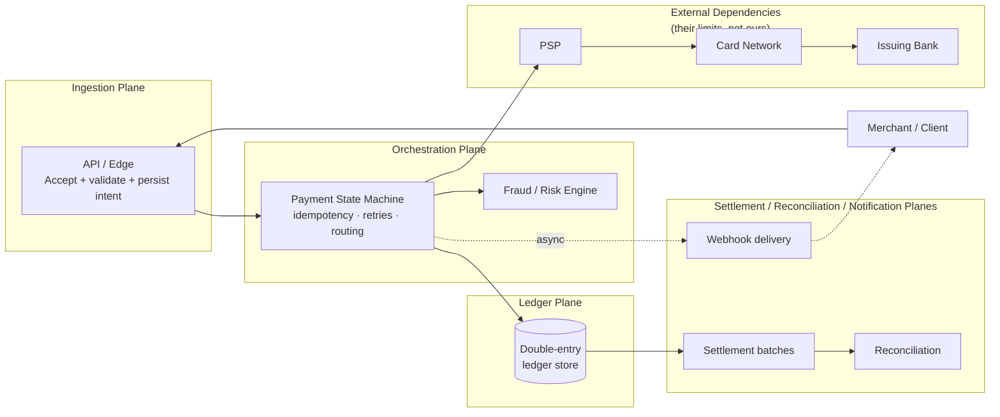

### The synchronous slice vs. everything else

Only a thin slice of this diagram is ever on the customer's synchronous critical path: **ingestion → a fast risk check → the PSP/network authorization call → a ledger write → the response**. Everything else — settlement, reconciliation, deep fraud modeling, webhook delivery, analytics — is designed from day one (even at 1 RPS, as a habit) to be **asynchronous and decoupled**, so that scaling the synchronous slice never requires scaling the back-office slice in lockstep, and a slowdown in the back office never delays a customer's checkout. This is the single most important habit this document tries to teach: identify what genuinely must happen before you answer the customer, and treat everything else as a fact to be recorded and processed later, reliably, but off the hot path.

### At-least-once delivery, not exactly-once fantasy

Every external hop in this system — the client's HTTP call, the call to the PSP, the webhook to the merchant — crosses an unreliable network. None of them can be made genuinely exactly-once end to end; a network can always lose an acknowledgment without losing the underlying request. This document follows the only approach that actually works at scale: **at-least-once delivery, paired with rigorous idempotency at every boundary**, so that retries are always safe and duplicates never move money twice. The idempotency key introduced in Stage 1 is not a nice-to-have — it is the load-bearing correctness mechanism the rest of this document assumes exists from the very first line of code.

### How to read this document

The journey runs through seven stages — 1, 10, 100, 1,000, 10,000, 100,000, and 1,000,000 RPS — using a running example gateway called **PayCore**. Every stage follows the same structure: current scale, how to build it, what breaks, why that forces the next step, why that specific next step (with trade-offs and alternatives), concrete payment-flow examples, and diagrams. Numbers throughout are **illustrative order-of-magnitude estimates** meant to build capacity-planning intuition, not sourced figures from any specific vendor — treat every "\~X req/sec" or "\~Y ms" as a rounded planning assumption to replace with your own measured data, exactly as Stage 1's own advice will say about database indexes and Stage 7's will say about PSP contracts.

## 1. Stage 1 — 1 RPS: Prove the Domain Model

### 1.1 Current Scale

One request per second is roughly 86,400 payment attempts a day — a single mid-size merchant, or an internal pilot. At this volume the entire system fits on one machine, and the engineering goal is not raw performance. It is getting the payment domain model, the idempotency contract, and the ledger shape correct, because every later stage inherits these decisions and they are expensive to change once real money is moving through them.

PayCore starts here: one Spring Boot 3.x application on Java 21, one PostgreSQL database, one synchronous call out to a single PSP (payment service provider).

### 1.2 How To Build This Step

**Architecture.** A modular monolith, deployed as a single JAR. Internally it is already split into packages by responsibility — `ingestion`, `orchestration`, `ledger`, `psp`, `notification` — mirroring the six planes from the foundational framing even though they all run in one process. This costs nothing at 1 RPS and saves months of untangling later.

```
paycore/
  ingestion/      PaymentController, request validation, idempotency check
  orchestration/  PaymentStateMachine, PaymentService
  ledger/         LedgerService, double-entry postings
  psp/            PspClient (Stripe/Adyen-style REST client)
  notification/   WebhookSender
  common/         Money type, PaymentStatus enum
```

**Spring Boot implementation approach.** A single `POST /v1/payments` endpoint, `@RestController` → `@Service` → `@Repository`, all inside one `@Transactional` boundary per request. Java 21 virtual threads (`spring.threads.virtual.enabled=true`) are turned on from day one so the blocking PSP call doesn't need to be re-architected later — it's a one-line config change now instead of a rewrite at Stage 3.

```java
@RestController
@RequestMapping("/v1/payments")
class PaymentController {

    private final PaymentService paymentService;

    @PostMapping
    ResponseEntity<PaymentResponse> authorize(
            @RequestHeader("Idempotency-Key") String idempotencyKey,
            @Valid @RequestBody PaymentRequest request) {
        PaymentResult result = paymentService.authorize(idempotencyKey, request);
        return ResponseEntity.status(result.httpStatus()).body(result.toResponse());
    }
}

@Service
class PaymentService {

    @Transactional
    PaymentResult authorize(String idempotencyKey, PaymentRequest request) {
        Optional<Payment> existing = paymentRepository.findByIdempotencyKey(idempotencyKey);
        if (existing.isPresent()) {
            return PaymentResult.fromExisting(existing.get()); // replay, not a new charge
        }

        Payment payment = Payment.createPending(idempotencyKey, request);
        paymentRepository.save(payment);

        PspResponse pspResponse = pspClient.authorize(request); // synchronous, blocking
        payment.applyPspResult(pspResponse);
        ledgerService.postAuthorization(payment);
        paymentRepository.save(payment);

        return PaymentResult.from(payment);
    }
}
```

**Database choice.** A single PostgreSQL instance (RDS/Cloud SQL single-AZ is fine here). Postgres is chosen over MySQL for its stronger native support for `NUMERIC` monetary types, partial/unique indexes used for idempotency, and `SERIALIZABLE`/`REPEATABLE READ` isolation semantics that the ledger will lean on later — switching engines after Stage 2 is painful, so the choice is made once, early, deliberately.

The schema already reflects double-entry ledger thinking, even though volume doesn't demand it yet:

```sql
CREATE TABLE payments (
    id              UUID PRIMARY KEY DEFAULT gen_random_uuid(),
    idempotency_key TEXT NOT NULL,
    status          TEXT NOT NULL,        -- PENDING, AUTHORIZED, FAILED, CAPTURED
    amount_minor    BIGINT NOT NULL,      -- integer minor units, never FLOAT
    currency        CHAR(3) NOT NULL,
    psp_reference   TEXT,
    created_at      TIMESTAMPTZ NOT NULL DEFAULT now(),
    updated_at      TIMESTAMPTZ NOT NULL DEFAULT now(),
    CONSTRAINT uq_idempotency_key UNIQUE (idempotency_key)
);

CREATE TABLE ledger_entries (
    id            UUID PRIMARY KEY DEFAULT gen_random_uuid(),
    payment_id    UUID NOT NULL REFERENCES payments(id),
    account       TEXT NOT NULL,          -- e.g. 'merchant_receivable', 'psp_clearing'
    direction     TEXT NOT NULL,          -- DEBIT or CREDIT
    amount_minor  BIGINT NOT NULL,
    created_at    TIMESTAMPTZ NOT NULL DEFAULT now()
);
```

The `UNIQUE (idempotency_key)` constraint is the real idempotency mechanism — not application logic. A concurrent duplicate request will hit a database constraint violation, which the service catches and treats as a replay. This is the pattern that survives every later stage: idempotency is enforced at the storage layer, never trusted to "the caller only sent it once."

**Deployment model.** One VM or one container, no orchestrator. A process supervisor (systemd, or a single ECS/Cloud Run instance) restarts it on crash. No load balancer yet — DNS points straight at the instance.

**Caching, queues, observability, security, fault tolerance.** No cache, no queue — there is nothing to cache and nothing to decouple at 1 RPS. Observability is minimal but not absent: structured JSON logs with a correlation ID per request, and Micrometer wired to a hosted metrics backend from day one (`payment.authorize.duration`, `payment.authorize.result`) so the habit — and the dashboards — already exist when it starts to matter. Security is not deferred: TLS everywhere, secrets in a managed secret store (not `application.yml`), and card data is never stored — PayCore accepts a PSP-tokenized card reference from the client, never a raw PAN. This single decision keeps PayCore's own database out of full PCI-DSS SAQ D scope from the very first line of code.

### 1.3 Challenges And Limitations

At 1 RPS nothing breaks from load. The real risks are correctness risks that are invisible under low traffic and catastrophic once they're not: no idempotency key handling means a client's retried request becomes a double charge; no idempotent schema constraint means a race between two "simultaneous" retries both succeed; storing floats for money produces off-by-a-cent ledger breaks that don't show up until reconciliation, months later. A single instance is also a single point of failure — acceptable for a pilot, not for anything real — and the synchronous PSP call means PayCore's own latency is a direct function of the PSP's latency, with no isolation between them yet.

### 1.4 Why We Move To The Next Step

The trigger isn't load, it's production readiness: real card data, real compliance obligations, and the requirement to survive a restart or an AZ failure without losing a payment or double-charging a customer. 1 RPS is a prototype; 10 RPS is the same code held to production standards — durable connections, retries, monitoring that pages someone, and a PCI-DSS posture that will hold up to an audit.

### 1.5 Why This Next Step Was Chosen

Rather than jumping straight to horizontal scale, Stage 2 hardens the *same* single-instance architecture. The trade-off: it delays solving throughput problems, but it means the idempotency contract, the ledger schema, and the retry semantics get proven correct under real (if modest) production conditions before they're replicated across ten instances. Fixing a ledger bug on one instance is a bug fix; fixing the same bug after it has run on a fleet for a month is a reconciliation project.

### 1.6 Alternatives Considered

*Skip straight to a distributed architecture.* Rejected: introduces coordination complexity (service discovery, distributed tracing, network partitions) before the payment domain logic itself is trustworthy — debugging "is this a ledger bug or a network bug" is much harder in a distributed system.

*Use a NoSQL store (DynamoDB/MongoDB) instead of PostgreSQL.* Would scale writes more easily later, but sacrifices the multi-row ACID transactions the ledger needs (an authorization and its ledger postings must commit together or not at all) and the mature indexing PayCore will lean on for reconciliation queries. Considered again at Stage 5+ for specific high-volume, less relationally-constrained tables (e.g. raw webhook delivery logs), not for the core ledger.

*Use MySQL instead of PostgreSQL.* A reasonable alternative — MySQL scales similarly and is equally production-proven. PostgreSQL is chosen here for `NUMERIC` precision defaults, richer partial-index support for the idempotency and reconciliation queries used from Stage 3 onward, and native `LISTEN/NOTIFY` used opportunistically in Stage 2–3 before a real message queue is introduced.

### 1.7 Real Examples

**Idempotency key.** The client generates a UUID once per logical payment attempt and resends the *same* key on every retry of that attempt (network timeout, client crash, user double-click). PayCore's `UNIQUE (idempotency_key)` constraint means the second insert fails with a constraint violation; the service catches `DataIntegrityViolationException`, re-reads the existing row, and returns its result instead of charging twice.

**Payment authorization.** `POST /v1/payments` with `{"amountMinor": 4999, "currency": "USD", "cardToken": "tok_abc123"}` synchronously calls the PSP's `/authorize` endpoint, waits for its response (typically 200–800ms), and returns `201 Created` with `status: AUTHORIZED` or `402 Payment Required` with a decline reason — all within one HTTP request/response cycle.

**Ledger update.** A successful authorization writes two balanced ledger rows in the same transaction as the payment status update: a debit to `psp_clearing` and a credit to `merchant_receivable`, both for the same `amount_minor`. The invariant — every payment's ledger entries sum to zero — is checked in a nightly batch job even at this tiny scale, establishing the reconciliation habit early.

### 1.8 Diagrams

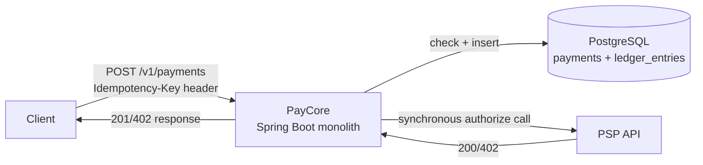

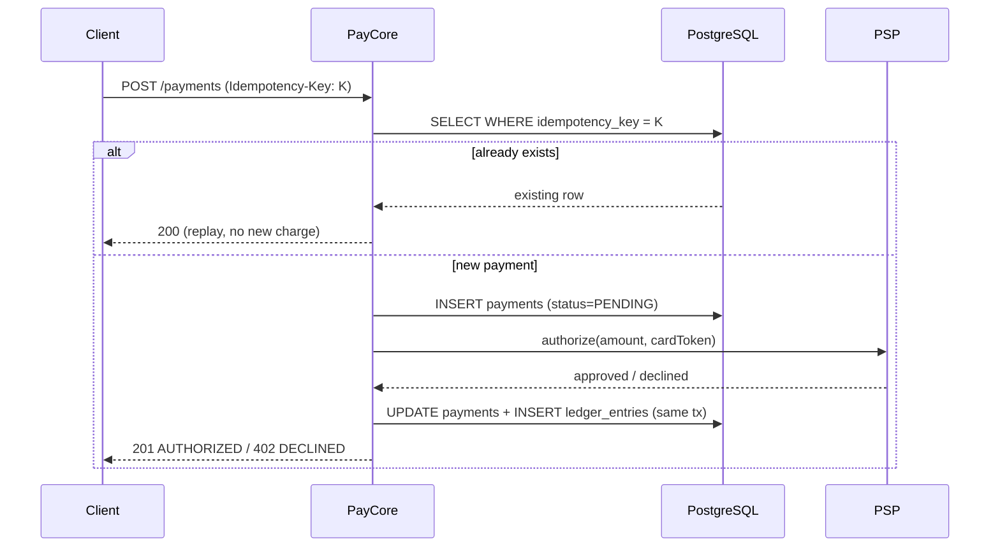

## 2. Stage 2 — 10 RPS: Production Hardening

### 2.1 Current Scale

10 RPS is \~864,000 payments/day — a real, live merchant base. The architecture is unchanged (still one modular monolith), but it must now survive real traffic patterns: bursts, slow clients, PSP timeouts, and an on-call engineer being paged at 3am. This is the stage where PayCore stops being a prototype and becomes a system someone depends on.

### 2.2 How To Build This Step

**Architecture.** Same modular monolith, now run as two or three identical instances behind a simple load balancer, purely for availability (not throughput — one instance could still handle 10 RPS comfortably). This forces statelessness early: no in-memory session state, no local caches that could disagree between instances, nothing written to local disk that isn't also in the database.

**Spring Boot implementation approach.** The PSP call gets real resilience wrapping via Resilience4j — timeout, retry with jitter, and a circuit breaker — because at this volume a slow PSP is no longer a rare event, it's a Tuesday.

```java
@CircuitBreaker(name = "pspClient", fallbackMethod = "authorizeFallback")
@Retry(name = "pspClient")
@TimeLimiter(name = "pspClient")
PspResponse authorize(PaymentRequest request) {
    return restClient.post()
        .uri("/authorize")
        .body(request)
        .retrieve()
        .body(PspResponse.class);
}
```

```yaml
resilience4j:
  timelimiter:
    instances:
      pspClient:
        timeout-duration: 3s
  retry:
    instances:
      pspClient:
        max-attempts: 3
        wait-duration: 200ms
        retry-exceptions: [java.net.SocketTimeoutException]
        # NEVER blind-retry a request that may have already reached the PSP;
        # retries reuse the SAME idempotency key sent to the PSP itself.
  circuitbreaker:
    instances:
      pspClient:
        sliding-window-size: 20
        failure-rate-threshold: 50
        wait-duration-in-open-state: 10s
```

The critical detail: retries are only safe because the *same* idempotency key is forwarded to the PSP on every attempt (most PSPs accept an `Idempotency-Key` header themselves). Retrying with a new key would risk a double authorization at the PSP, one layer outside PayCore's own database constraint.

**Database choice.** PostgreSQL, now Multi-AZ with synchronous replication for automatic failover, and HikariCP tuned deliberately rather than left on defaults:

```yaml
spring:
  datasource:
    hikari:
      maximum-pool-size: 20   # small on purpose: DB connections are the scarce resource
      minimum-idle: 5
      connection-timeout: 2000
      leak-detection-threshold: 5000
```

A useful rule of thumb carried forward through every later stage: `pool_size ≈ (avg_query_time_ms × target_rps) / 1000`, per instance — sized to the database's real capacity, not to "however many threads happen to be running."

**Deployment model.** Two to three containers behind a managed load balancer (ALB/Cloud Load Balancing), each instance in a different availability zone. Rolling deploys, health checks (`/actuator/health`) gate traffic to new instances.

**Caching, queues, observability, security, fault tolerance.** Still no cache or queue — 10 RPS doesn't need them, and adding either now would be solving a problem that doesn't exist yet. Observability grows up: structured logs shipped to a central store, metrics dashboards with SLO-based alerts (p99 latency, error rate, PSP timeout rate), and a distributed trace ID that will matter once there's more than one hop. Security becomes a formal program, not a habit: this is the stage where PCI-DSS SAQ scoping is actually done (PayCore remains out of full card-data scope because it never touches a raw PAN), secrets rotate through a managed secrets manager, and every ledger mutation is written to an append-only audit log table separate from the operational tables. Fault tolerance: health checks + auto-restart, and a documented runbook for "PSP is down" (open the circuit, queue nothing yet, fail fast with a clear error the merchant's system can retry against).

### 2.3 Challenges And Limitations

The PSP is now a visible bottleneck: at 200–800ms per call and one thread (virtual thread) per in-flight request, a PSP slowdown to 3s doesn't crash PayCore, but it does back up the connection pool and the thread count, and p99 latency balloons well before CPU or memory do. A single Postgres primary is now a real single point of failure for writes — Multi-AZ handles instance failure but not a poorly-indexed query holding locks. And without any caching, every request pays a full database round trip, which is fine at 10 RPS but is the first thing that will hurt at 100 RPS.

### 2.4 Why We Move To The Next Step

The trigger is read amplification, not write volume: as merchant dashboards, status polling, and reconciliation queries are added, the *read* traffic against the payments table grows faster than the *write* (authorization) traffic, and every one of those reads is still hitting the primary. That's the bottleneck that forces Stage 3.

### 2.5 Why This Next Step Was Chosen

Stage 3 introduces caching and read replicas rather than jumping to horizontal write-scaling or microservices, because the actual pressure at 100 RPS is read-side, and it's the cheapest problem to solve: a cache and a replica add no new failure modes as severe as a network partition between services would. Trade-off: this defers the real horizontal-scaling and service-decomposition work, but that work isn't justified yet — doing it now would be optimizing for a scale that doesn't exist.

### 2.6 Alternatives Considered

*Add a queue now, for the webhook sends.* Reasonable, and revisited at Stage 4 — at 10 RPS, synchronous best-effort webhook delivery with a retry loop is simpler and sufficient.

*Move to microservices immediately, since "payments should be split from day one."* Rejected at this scale: splitting into services multiplies operational overhead (service discovery, network calls, distributed transactions) for a system that a single database can still serve with room to spare. Premature decomposition here would slow the team down without buying real capacity.

### 2.7 Real Examples

**Retry handling.** A PSP call times out at 3s. Resilience4j retries up to 2 more times with the *same* idempotency key and a jittered 200ms backoff. If all three attempts fail, the circuit breaker's failure count increments; after 50% of the last 20 calls fail, the circuit opens and subsequent calls fail fast for 10 seconds rather than piling up against a PSP that's clearly struggling.

**Fraud checks.** A lightweight synchronous rule check (velocity: "has this card attempted >3 payments in 60 seconds?") runs in-process against a small in-memory counter before the PSP call — cheap enough to stay synchronous at this scale, and it's explicitly flagged in code as a placeholder for the dedicated fraud engine that arrives at Stage 5.

**External PSP call.** The `PspClient` now carries a hard 3-second timeout, distinguishing a *declined* payment (PSP answered "no") from a *timed-out* payment (PSP never answered — status is unknown, and PayCore must not assume success or failure, only retry the status check using the idempotency key).

### 2.8 Diagrams

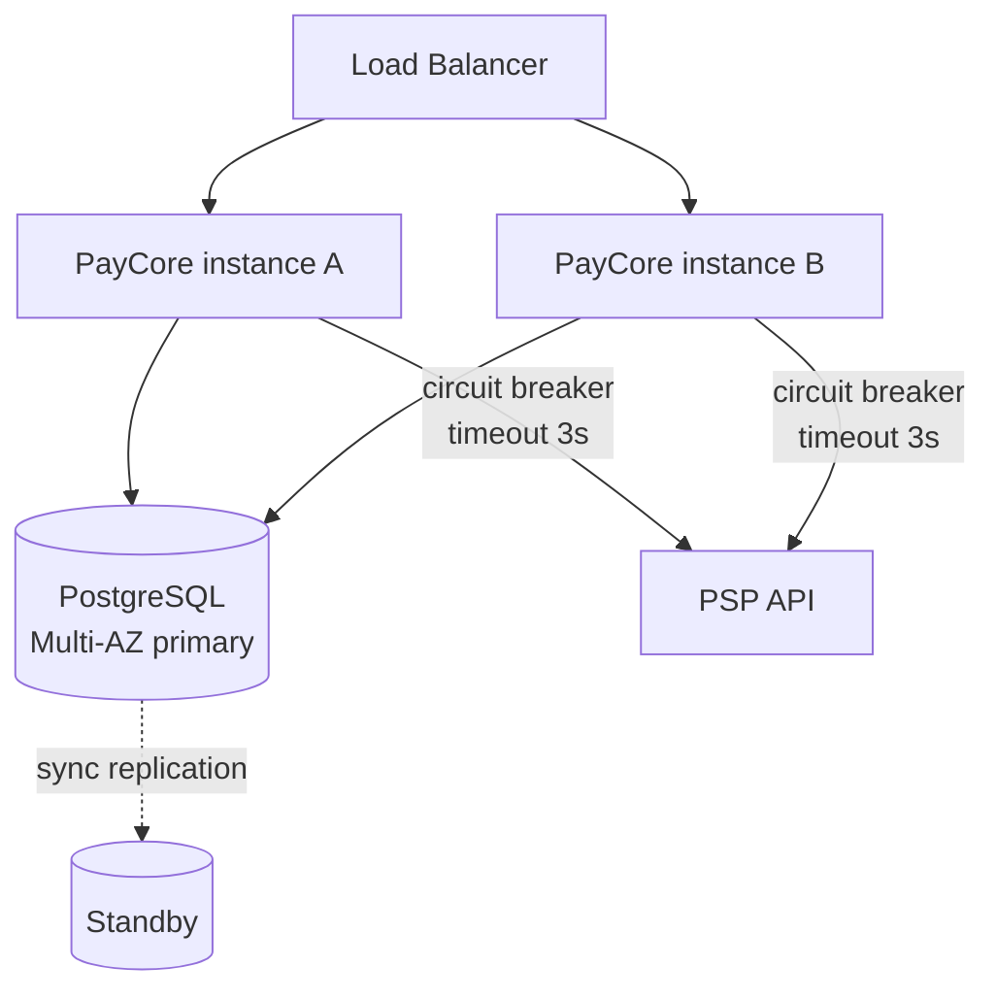

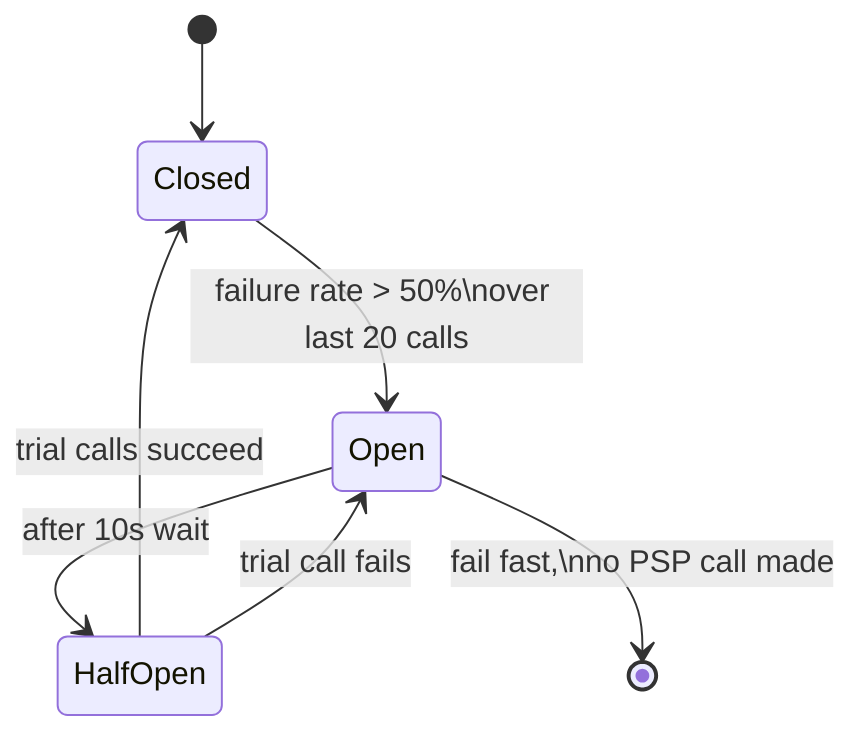

## 3. Stage 3 — 100 RPS: Caching, Read Replicas, and the First Real Indexing Pass

### 3.1 Current Scale

100 RPS is \~8.6M payments/day — a real platform with multiple merchants and dashboards, status pages, and reconciliation jobs all reading the same tables the authorization path writes to. The write path (authorizations) is still small relative to reads (status checks, merchant dashboards, internal tooling). This is the stage where read pressure, not write pressure, becomes the dominant problem.

### 3.2 How To Build This Step

**Architecture.** Still one deployable, but internally reorganized into a true modular monolith with enforced module boundaries (ArchUnit tests fail the build if `ledger` code reaches directly into `psp`'s internals, for instance). This is the last stage where a single deployable is the right choice — Stage 4 starts pulling pieces out.

**Spring Boot implementation approach.** A read-through cache in front of the hottest read query — payment status lookups — using Redis via Spring Cache:

```java
@Cacheable(value = "paymentStatus", key = "#paymentId", unless = "#result.status() == 'PENDING'")
PaymentStatusView getStatus(UUID paymentId) {
    return paymentRepository.findStatusView(paymentId);
}

@CacheEvict(value = "paymentStatus", key = "#payment.id()")
void onStatusChange(Payment payment) { /* called from the state machine on every transition */ }
```

Only *terminal* states (`AUTHORIZED`, `FAILED`, `CAPTURED`) are cached (`unless`) — a `PENDING` status is still changing and must never be served stale, since a merchant polling for "did this succeed" reading a cached `PENDING` after it actually authorized is a real bug, not a cosmetic one. TTL is short (30–60s) as a safety net on top of explicit eviction, never relied on alone.

**Database choice.** PostgreSQL primary + 1–2 read replicas, with the application explicitly routing: writes and anything read-your-own-write (the authorization response itself) go to the primary; dashboards, reporting, and reconciliation queries go to a replica via a second `DataSource` bean. This is also the stage where indexing gets deliberate rather than default:

```sql
CREATE INDEX CONCURRENTLY idx_payments_merchant_created
    ON payments (merchant_id, created_at DESC);

CREATE INDEX CONCURRENTLY idx_payments_status_created
    ON payments (status, created_at)
    WHERE status IN ('PENDING', 'FAILED');   -- partial index: skips the huge AUTHORIZED/CAPTURED majority

-- Table partitioning by month, preparing for the volume that arrives at Stage 4-5
CREATE TABLE payments_2026_09 PARTITION OF payments
    FOR VALUES FROM ('2026-09-01') TO ('2026-10-01');
```

Replica reads are explicitly allowed to be a few hundred milliseconds stale (replication lag) — acceptable for a merchant dashboard, never acceptable for the authorization decision itself, which always reads the primary.

**Deployment model.** Four to six instances behind the load balancer, now with autoscaling on CPU/request-latency rather than a fixed instance count. Redis runs as a managed, replicated cluster (not a single node — a cache that's also a single point of failure defeats the purpose).

**Caching, queues, observability, security, fault tolerance.** Caching arrives (above). Still no message queue — webhook delivery is still synchronous-with-retry, though its retry loop is now visibly a source of thread contention under load, flagged for Stage 4. Observability adds cache hit-rate as a first-class metric (a falling hit rate is often the earliest warning of a hot-key or traffic-shape change). Security: rate limiting appears for the first time, per-API-key, using Redis as a token-bucket counter — both to protect PayCore from abusive clients and, just as importantly, to protect the PSP relationship, since PSPs themselves impose per-merchant rate limits that a misbehaving client could otherwise blow through. Fault tolerance: the circuit breaker from Stage 2 is now backed by a documented degraded mode — if Redis is unreachable, the application fails open (skips the cache, hits the database directly) rather than failing the request.

### 3.3 Challenges And Limitations

Cache invalidation is now a real source of bugs: a missed `@CacheEvict` path (e.g., a status change triggered by an async webhook from the PSP rather than the synchronous flow) leaves a stale cached status served to a merchant. Read replica lag becomes visible — a merchant who creates a payment and immediately queries a dashboard fed by a replica can see "not found" for a few hundred milliseconds. Connection pool sizing gets harder: more instances × pool size can exceed Postgres's `max_connections` (typically 100–500) even though *no single instance* looks over-provisioned. And the synchronous webhook retry loop now measurably steals capacity from the authorization path under load, since both share the same thread pool and PSP-facing egress budget.

### 3.4 Why We Move To The Next Step

The forcing function is connection exhaustion and coupling: as instance count grows toward the next order of magnitude, `instances × pool_size` will exceed what Postgres can hold, and the synchronous webhook path is now visibly competing with the authorization path for the same resources. Decoupling non-critical work (webhooks, notifications, async fraud scoring) from the critical path is the only way to keep growing instance count without growing database connections and PSP-facing thread contention in lockstep.

### 3.5 Why This Next Step Was Chosen

Stage 4 introduces horizontal scaling behind a proper API gateway and a message queue for the first time, rather than simply adding more replicas or a connection pooler alone (though PgBouncer is added too). The trade-off: a queue introduces at-least-once delivery and eventual consistency for the flows moved onto it (webhooks, notifications) — real complexity — but it's confined to flows that were already tolerant of a few hundred milliseconds of asynchrony, so the complexity is paid for where it's cheap, not where it's expensive (the authorization decision itself stays synchronous).

### 3.6 Alternatives Considered

*Just add more read replicas indefinitely.* Works for read scaling but doesn't address write throughput or the webhook/authorization coupling — treats a symptom, not the underlying resource contention.

*Introduce sharding now.* Premature — a single primary with replicas and good indexing comfortably serves 100–1,000 RPS of this shape; sharding's operational cost (cross-shard queries, rebalancing) isn't justified until Stage 5.

*Cache at the database level (materialized views) instead of Redis.* Considered for the merchant dashboard specifically, and adopted there in later stages for heavy aggregate queries — but Redis is chosen for the hot single-row status lookup because it's an order of magnitude faster and doesn't add load to the database it's protecting.

### 3.7 Real Examples

**Idempotency + cache interaction.** A replayed request (same idempotency key) is served from the `paymentStatus` cache when the underlying payment is terminal, meaning a retried request under load doesn't even reach the database — which matters, because retries spike precisely when the system is already under stress.

**Ledger updates — partial index in action.** The reconciliation job's query ("find all payments still `PENDING` after 10 minutes") uses `idx_payments_status_created`, scanning a tiny partial index instead of the full multi-hundred-million-row table — the difference between a 5ms query and a 4-second one.

**Fraud checks.** The velocity check from Stage 2 now reads its counters from Redis instead of in-process memory, so it stays correct across multiple instances (an in-memory counter per instance would undercount a card hitting different instances behind the load balancer).

### 3.8 Diagrams

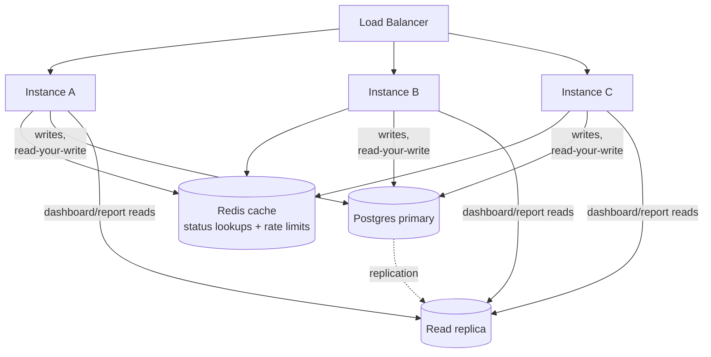

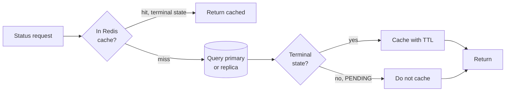

## 4. Stage 4 — 1,000 RPS: Horizontal Scale, a Gateway, and a Queue

### 4.1 Current Scale

1,000 RPS is \~86M payments/day — a large national payments platform. The single biggest shift at this stage is architectural: the request path and the notification path are formally split, because they no longer share the same capacity profile or the same tolerance for latency.

### 4.2 How To Build This Step

**Architecture.** An API gateway (Spring Cloud Gateway, or a managed gateway like Kong/AWS API Gateway) now sits in front of everything, handling TLS termination, auth, rate limiting, and routing — removing those concerns from the application instances. Behind it, PayCore is still one deployable (splitting into services is Stage 5's job, not this one), but it now publishes domain events to a message queue for everything that isn't the authorization decision itself.

**Spring Boot implementation approach.** The authorization path stays synchronous end-to-end (client is waiting for an answer), but on success it publishes a `PaymentAuthorized` event to Kafka *in the same database transaction* using the transactional outbox pattern — never a direct dual-write to both Postgres and Kafka, which can lose events on a crash between the two writes.

```java
@Transactional
PaymentResult authorize(String idempotencyKey, PaymentRequest request) {
    Payment payment = /* ... same flow as before ... */;
    ledgerService.postAuthorization(payment);
    outboxRepository.save(OutboxEvent.of("PaymentAuthorized", payment.id(), payment.toEventPayload()));
    // one transaction, one commit: payment + ledger + outbox row, all-or-nothing
    return PaymentResult.from(payment);
}
```

A separate poller (Debezium CDC, or a simple polling publisher) reads the `outbox` table and publishes to Kafka, then marks rows sent — guaranteeing at-least-once delivery to Kafka without ever losing an event to a crashed dual-write. Webhook delivery, notification emails, and async fraud re-scoring all become Kafka *consumers* of this event stream, fully decoupled from the request thread:

```java
@KafkaListener(topics = "payment-events", groupId = "webhook-delivery")
void onPaymentEvent(PaymentEvent event) {
    webhookSender.deliverWithRetry(event);  // runs entirely off the request path now
}
```

**Database choice.** Still PostgreSQL, now with PgBouncer in front of it in transaction-pooling mode, decoupling "number of application instances" from "number of real Postgres connections" — PgBouncer can hold thousands of client connections while presenting Postgres with a few hundred. The `payments` table is now range-partitioned by month as standard practice (introduced experimentally at Stage 3), keeping indexes small and vacuum/autovacuum manageable.

**Deployment model.** Kubernetes, replacing the fixed container fleet — this is the stage where the operational complexity of an orchestrator starts paying for itself: `HorizontalPodAutoscaler` on request rate and CPU, `PodDisruptionBudget` to keep capacity during rolling deploys and node maintenance, readiness/liveness probes wired to `/actuator/health/readiness` and `/liveness`.

**Caching, queues, observability, security, fault tolerance.** Kafka (or SQS/RabbitMQ for lower-throughput event needs) arrives as core infrastructure. Rate limiting moves to the gateway, applied per API key and per merchant tier, with a documented 429 + `Retry-After` contract. Bulkheads appear for the first time: the PSP-calling thread pool is isolated from the webhook-consuming thread pool from the database-query thread pool, so a slow PSP can no longer starve webhook delivery or vice versa (`Resilience4j Bulkhead`, or simply separate `Executor`s per Kafka listener container). Observability adds consumer lag as a monitored metric — a growing lag on `webhook-delivery` means notifications are falling behind even though authorizations are fine, and that distinction now matters operationally. Security: the outbox/event payloads are audited for PCI scope the same way API payloads are — no raw PAN ever enters an event.

### 4.3 Challenges And Limitations

Kafka introduces a new failure mode class: consumer lag, rebalancing pauses, and "exactly-once was never actually promised" — every consumer must be idempotent, because Kafka's at-least-once delivery means a webhook consumer *will* occasionally see the same event twice (a rebalance mid-processing is the common cause). The outbox poller itself becomes a component that needs its own monitoring — if it stalls, events silently stop flowing even though the authorization path looks perfectly healthy. And Kubernetes brings genuine operational overhead: misconfigured resource requests/limits now directly cause either wasted spend or throttled pods under load.

### 4.4 Why We Move To The Next Step

The trigger is that the single deployable itself becomes the bottleneck for independent scaling and independent failure: the fraud-scoring logic needs different (heavier, ML-model-backed) compute than the authorization path; the ledger needs different consistency guarantees and different scaling (it's write-heavy and append-mostly) than everything else; and a bug or a slow deploy in one area now risks the whole system, when in reality these are different services with different SLOs pretending to be one.

### 4.5 Why This Next Step Was Chosen

Stage 5 splits the monolith into services along the six-plane boundaries established in Stage 1's package structure — those boundaries were kept clean specifically so this split could happen along module lines rather than requiring a rewrite. The trade-off is substantial: distributed transactions are no longer available, so cross-service consistency must move to sagas and eventual consistency, and there's real new operational surface (service discovery, per-service deployment, network calls that can partially fail). It's chosen anyway because at this scale, independent scaling and independent failure domains stop being nice-to-haves and start being the only way to keep any one team's changes from threatening the whole payment path.

### 4.6 Alternatives Considered

*Scale the monolith further instead of splitting it.* Viable a while longer — a well-tuned monolith on Kubernetes with good autoscaling can plausibly reach several thousand RPS. Rejected as the long-term path because it doesn't solve the independent-failure-domain problem: a memory leak in the fraud module still takes down authorization.

*Use RabbitMQ instead of Kafka.* A legitimate choice, and often simpler to operate at moderate scale. Kafka is chosen here because of its log-based replay (useful for reconciliation and rebuilding read models later) and its proven throughput ceiling well past what this system will need even at Stage 7; RabbitMQ remains a good fit for lower-throughput, routing-heavy internal messaging and is used that way in later stages for select internal queues.

### 4.7 Real Examples

**Webhooks.** A merchant's webhook endpoint is down for five minutes. Instead of that blocking or dropping anything on the authorization path, the `webhook-delivery` consumer group simply falls behind (lag grows), retries with exponential backoff per event, and catches up once the endpoint recovers — completely invisible to the authorization path.

**Idempotency at the consumer level.** The webhook consumer checks a `delivered_webhooks (event_id, delivered_at)` table before sending — because Kafka's at-least-once delivery means the same `PaymentAuthorized` event can arrive twice after a rebalance, and the merchant should still only get one webhook call (or, if two, one clearly marked as a duplicate delivery via a `X-Webhook-Delivery-Id` header they can dedupe on).

**Ledger updates via outbox.** The ledger posting and the `PaymentAuthorized` outbox row commit in the same database transaction — so a crash right after commit still results in the event eventually being published (the poller picks up the row on restart), and a crash right before commit means neither the ledger entry nor the event exist. No in-between state is possible.

### 4.8 Diagrams

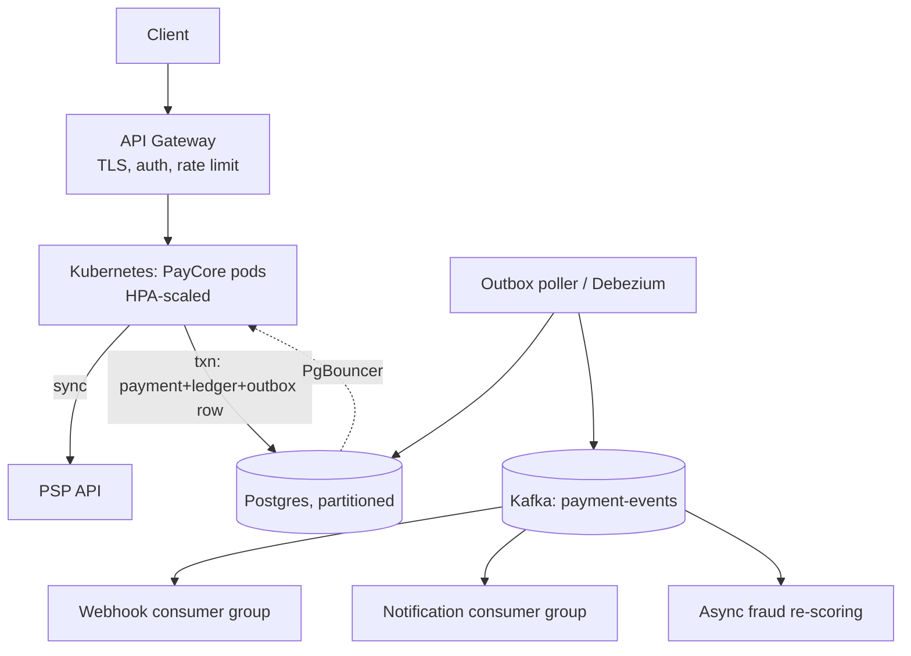

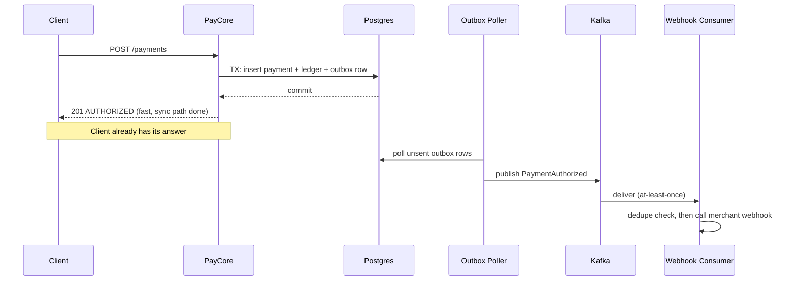

## 5. Stage 5 — 10,000 RPS: The Microservices Split

### 5.1 Current Scale

10,000 RPS is \~864M payments/day — among the largest payment platforms in the world at this point. The six planes from the foundational framing now become six (or more) independently deployed, independently scaled services, each with its own database and its own SLOs.

### 5.2 How To Build This Step

**Architecture.** The monolith is split along its module boundaries into: **Ingestion Service** (validates, authenticates, checks idempotency, admits requests), **Orchestration Service** (runs the payment state machine, calls the PSP), **Fraud Service** (scores risk, now ML-model-backed, previously an in-process velocity check), **Ledger Service** (owns the double-entry ledger, exposed only through its own API — no other service touches its tables directly), **Settlement Service**, **Reconciliation Service**, and **Notification Service**. Kafka is now the backbone connecting them, not an add-on.

**Spring Boot implementation approach.** Cross-service consistency moves from database transactions to an orchestrated saga, because a single ACID transaction spanning Orchestration and Ledger is no longer possible — they're different services with different databases.

```java
// Orchestration service: saga-style coordination via events, not RPC calls
@KafkaListener(topics = "payment-authorized")
void onAuthorized(PaymentAuthorizedEvent event) {
    ledgerClient.requestPosting(event.toLedgerCommand());  // async command, not a blocking call
}

// If the ledger posting fails (rare, but must be handled):
@KafkaListener(topics = "ledger-posting-failed")
void onLedgerFailure(LedgerPostingFailedEvent event) {
    paymentStateMachine.transitionTo(event.paymentId(), PaymentStatus.REQUIRES_MANUAL_REVIEW);
    alerting.page("ledger-posting-failure", event);  // compensating action + human escalation
}
```

CQRS is introduced specifically for the Ledger service: writes go through a strict double-entry command model; reads (merchant statements, reconciliation reports, dashboards) are served from a separately-updated read model (materialized views or a dedicated read replica shaped for query patterns, updated asynchronously from the same event stream) — because the write side's consistency requirements and the read side's query patterns (aggregations across millions of rows) have almost nothing in common.

**Database choice.** Each service owns its database; no shared schema. The Ledger service's Postgres is now sharded by merchant ID (or account ID) using a consistent-hashing router, because a single primary — even heavily indexed and replicated — cannot hold write throughput for hundreds of millions of ledger entries a day:

```java
int shardId = Math.floorMod(merchantId.hashCode(), TOTAL_SHARDS);
DataSource shard = shardRouter.route(shardId);
```

Cross-shard queries (global reconciliation totals) are answered by the CQRS read model, never by fanning out a live query across every shard synchronously.

**Deployment model.** Kubernetes with per-service namespaces, service mesh (Istio/Linkerd) for mTLS between services, retries, and traffic shifting during deploys, and a service registry (Kubernetes' own DNS-based discovery is usually sufficient; Eureka/Consul for more complex topologies). Each service scales independently — Fraud, being CPU/model-heavy, scales on a different curve than Ingestion, which is I/O-bound.

**Caching, queues, observability, security, fault tolerance.** Kafka topics now formally versioned and schema-governed (Avro/Protobuf with a schema registry) since dozens of consumers across services depend on event shape stability. Distributed tracing (OpenTelemetry, propagated across every service hop) becomes mandatory, not optional — a single payment's trace now spans 5+ services, and without tracing, debugging a slow payment means grepping logs across a dozen pods. Bulkheads apply per downstream dependency, not just per thread pool: the Orchestration service maintains a separate connection/thread budget per PSP it integrates with, so one struggling PSP integration can't starve calls to a healthy one. Security: mTLS between all services, a per-service least-privilege database credential, and centralized audit logging aggregated from every service (a single ledger mutation must be traceable end-to-end across Ingestion → Orchestration → Ledger for compliance).

### 5.3 Challenges And Limitations

Distributed systems problems arrive in force: partial failures (Ledger service healthy, Fraud service degraded — what does Orchestration do?), saga complexity (a payment stuck between "authorized" and "ledger posted" needs an explicit compensating/retry path, not just a try/catch), and cross-shard reconciliation (proving the global ledger balances when it's spread across dozens of shards is a genuinely hard batch/streaming problem). Schema evolution across services owned by different teams becomes an ongoing coordination cost. And the sheer number of moving parts means a full end-to-end load test is now itself a significant engineering project.

### 5.4 Why We Move To The Next Step

The trigger is geography and blast radius: at 10K RPS sustained, a single region's capacity ceiling (data center power, network egress, cloud-provider regional service quotas) becomes a real constraint, and — more importantly — a single-region outage (a cloud provider's regional incident) now means the entire platform is down, which is no longer an acceptable risk at this scale of dependency.

### 5.5 Why This Next Step Was Chosen

Stage 6 goes multi-region, active-active, rather than staying single-region with a passive DR site, because at this transaction volume the cost of a full region outage (hours of lost payment processing for a platform doing hundreds of millions of transactions a day) outweighs the substantial complexity of active-active operation. The trade-off is real: active-active forces every service to reckon with cross-region data consistency, conflict resolution, and regional routing — an order of magnitude harder than single-region operations.

### 5.6 Alternatives Considered

*Scale vertically within one region indefinitely (bigger shards, more replicas, bigger Kafka clusters).* Delays but doesn't eliminate the single-region-outage risk, and eventually hits real physical ceilings (regional network egress limits, cloud quota limits).

*Active-passive DR instead of active-active.* Simpler operationally — one region takes all traffic, a standby region is kept warm for failover. Rejected as the primary model at this scale because failover itself (DNS propagation, replication catch-up, the operational scramble of an actual regional failover) typically costs minutes to tens of minutes of full downtime, unacceptable for a platform processing this volume; still used as the pattern for smaller, less latency-sensitive internal services.

### 5.7 Real Examples

**Payment authorization saga.** Orchestration receives the PSP's approval, publishes `PaymentAuthorized`; Ledger consumes it and posts double-entry rows, publishes `LedgerPosted`; only once Orchestration observes `LedgerPosted` does it consider the payment fully settled internally (still returned to the client immediately after PSP approval — the saga's later steps are for internal consistency, not client-facing latency).

**Idempotency across services.** The idempotency key generated at Ingestion is propagated as a correlation ID through every downstream event and every downstream service's own idempotency check (Ledger, for instance, uses `(idempotency_key, account)` as its own uniqueness constraint) — a single key threading through the whole saga so a replayed event anywhere in the chain is a no-op everywhere.

**Fraud checks at scale.** The Fraud service now scores asynchronously for anything below a risk threshold (the payment proceeds while scoring happens in parallel, with the option to freeze/reverse if a late high-risk score comes back) and synchronously-blocking only for flagged high-risk segments — a deliberate sync/async split so fraud scoring latency doesn't tax every payment equally.

### 5.8 Diagrams

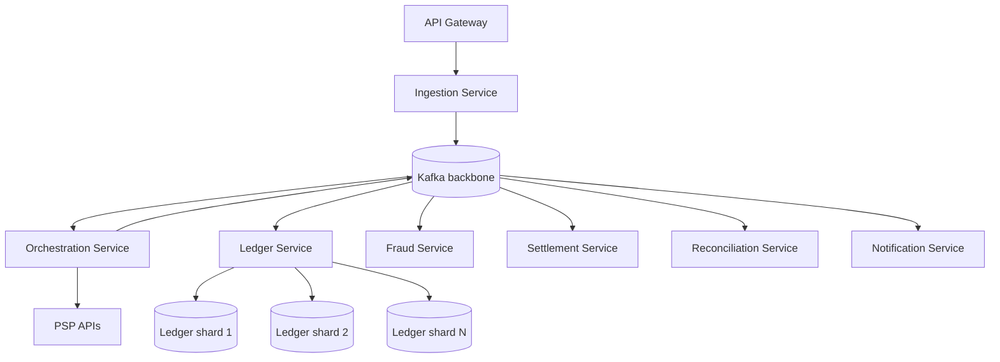

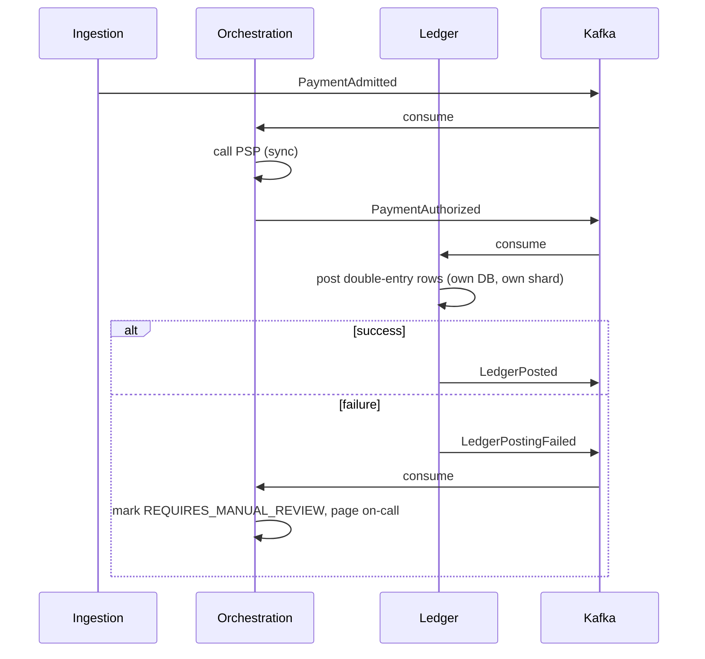

## 6. Stage 6 — 100,000 RPS: Multi-Region, Active-Active

### 6.1 Current Scale

100,000 RPS is comfortably beyond any single payment company's real card-present/card-not-present authorization volume — at this ingestion rate PayCore is now explicitly built to absorb bursts, bot/DDoS-shaped traffic, and multi-tenant load far above what settles as genuine authorizations, which is precisely the gap flagged in the foundational framing between ingestion RPS and authorization throughput. The system now runs across at least three geographic regions simultaneously, each fully capable of serving traffic.

### 6.2 How To Build This Step

**Architecture.** Every plane from Stage 5 is deployed in each region: regional Ingestion, Orchestration, and Fraud services handle local traffic with no cross-region call in the synchronous authorization path (a request landing in the EU region never waits on a US-region service to get its answer). The Ledger plane is regionally sharded — each account/merchant is homed to a primary region — with asynchronous cross-region replication for global reporting and disaster recovery, not for the write path itself.

**Spring Boot implementation approach.** Region-awareness becomes an explicit first-class concept rather than an infrastructure afterthought: every service reads its region from configuration and routes account-homed operations accordingly, rejecting (or forwarding, for specific well-understood cases like a traveling cardholder) writes for accounts homed elsewhere.

```java
@Service
class LedgerWriteRouter {
    PostingResult post(LedgerCommand command) {
        String homeRegion = accountRegionResolver.resolve(command.accountId());
        if (!homeRegion.equals(currentRegion)) {
            // Do not write locally against another region's shard of truth.
            // Forward the command, don't fake a local write.
            return crossRegionClient.forward(homeRegion, command);
        }
        return localLedgerService.post(command);
    }
}
```

Idempotency keys now carry a region prefix so cross-region replays and cross-region forwarded commands remain globally unique and traceable to their region of origin.

**Database choice.** Each region's Ledger shard set is its own write-authoritative store for its homed accounts; cross-region replication (logical replication, or a change-data-capture pipeline into a global analytical store) feeds reconciliation and reporting, which now tolerate seconds, not milliseconds, of cross-region staleness by design — an explicit, documented trade-off, not an accident.

**Deployment model.** Kubernetes clusters per region, fronted by a global load balancer/anycast routing layer (e.g., Cloudflare, AWS Global Accelerator, or DNS-based geo-routing) that sends each request to its nearest healthy region. Regional health checks feed automated traffic shifting — a degraded region has its weight reduced or zeroed without a human in the loop for the common cases.

**Caching, queues, observability, security, fault tolerance.** Kafka runs as per-region clusters with selective cross-region topic replication (MirrorMaker 2 or equivalent) for the specific event streams that need global visibility (global fraud signals, global reconciliation), not a single global Kafka cluster — cross-region synchronous replication for a system at this throughput would make every write pay a cross-continent round trip. The Fraud service gets its own dedicated scaling story: model inference is now its own tier, often GPU-backed, autoscaled independently and shielded behind a strict timeout — if a fraud score doesn't arrive in time, the system falls back to a conservative default (hold for review on high-value transactions, allow with post-hoc scoring on low-value ones) rather than blocking the payment indefinitely. Per-PSP bulkheads become per-region-per-PSP: each region maintains its own connection budget to each PSP integration, both for isolation and because many PSPs contractually cap total request rate per integration credential, which now must be tracked and enforced (with proactive backpressure, not just reactive 429 handling) before PayCore's own aggregate traffic exceeds a PSP's ceiling. Security: encryption in transit between regions, region-scoped secrets, and audit logs that record region of origin for every ledger mutation, feeding compliance requirements that increasingly vary by jurisdiction (data residency).

### 6.3 Challenges And Limitations

External PSP limits are now frequently the binding constraint, not PayCore's own infrastructure: a PSP integration might cap out at a few thousand authorizations/second regardless of how much PayCore itself can process, which is exactly why the foundational framing's distinction (ingestion ≠ authorization throughput) matters operationally, not just conceptually — PayCore must rate-limit and queue against each PSP's real ceiling, using multiple PSP relationships and intelligent routing/failover between them (PSP multiplexing) rather than assuming any single PSP scales with PayCore. Cross-region consistency bugs are subtle and expensive: a traveling cardholder whose account is homed in one region but who authenticates from another needs careful routing, and getting this wrong risks either rejecting a legitimate payment or writing to the wrong region's shard of truth. Global reconciliation — proving every region's books balance and that cross-region replication hasn't dropped anything — is now a continuous streaming problem, not a nightly batch job.

### 6.4 Why We Move To The Next Step

The trigger to Stage 7 is less about a single new bottleneck and more about hardening every seam found at Stage 6 against the traffic PayCore must now assume is partially adversarial: bot traffic, retry storms from misbehaving integrators, and regional failure cascades all become statistically routine at this scale, and the architecture must isolate blast radius down to a much finer grain than "region" — a single noisy tenant or a single bad deploy must not be able to consume a whole region's capacity.

### 6.5 Why This Next Step Was Chosen

Stage 7 adopts a cell-based architecture — partitioning each region into multiple independent, identically-provisioned "cells," each serving a bounded slice of accounts/traffic — layered on top of the multi-region model rather than simply adding more capacity per region. The trade-off: cells add routing complexity and some resource inefficiency (each cell needs headroom, so aggregate over-provisioning is higher than one large pooled region), but they cap the blast radius of any single failure or noisy-neighbor problem to one cell's slice of traffic instead of an entire region.

### 6.6 Alternatives Considered

*Keep scaling regions larger instead of subdividing them.* Rejected as the sole strategy at this scale: a single region's Kubernetes cluster and Kafka cluster eventually hit real operational ceilings (cluster size, blast radius of a bad config push), and "bigger region" doesn't bound the damage a single bad actor or bad deploy can do.

*Active-passive with a very fast automated failover (seconds, not minutes).* Technically closer to feasible with modern tooling, but still concentrates all traffic on one region at a time, which means that region alone must carry 100% of global capacity — active-active is chosen instead so that no single region needs to be provisioned for more than its own fair share plus a manageable failover margin.

### 6.7 Real Examples

**Settlement processing.** Settlement batches (grouping authorized-and-captured payments for transfer to merchants) now run per-region-per-shard, each producing region-scoped settlement files, which are then aggregated centrally for merchant-level reporting that spans regions — the settlement computation itself stays local to where the ledger data lives, avoiding a cross-region fan-out for every batch run.

**Retry handling with PSP multiplexing.** If PSP A's circuit breaker opens in a given region, the Orchestration service in that region fails over to PSP B for new authorizations (where contractually and technically supported), rather than queuing requests indefinitely against a PSP that's clearly degraded — a capability that requires PayCore's PSP integration layer to be built provider-agnostic from early on.

**Webhooks at scale.** Webhook delivery is now rate-limited per merchant *endpoint*, not just globally, because a single merchant's slow endpoint consuming a disproportionate share of a shared delivery worker pool is a real noisy-neighbor problem at this volume; each merchant's webhook queue is isolated enough that one slow integrator can't delay another's notifications.

### 6.8 Diagrams

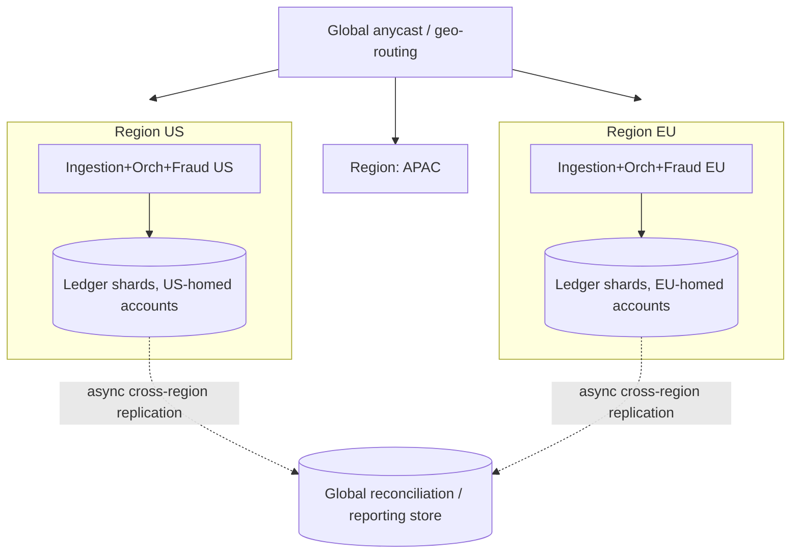

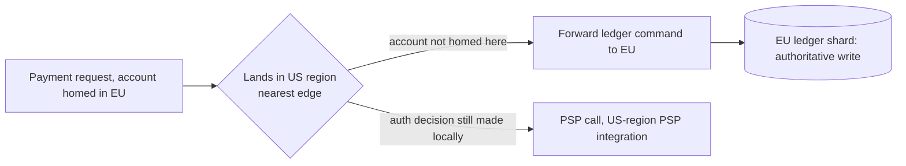

## 7. Stage 7 — 1,000,000 RPS: Cell-Based Architecture at the Edge

### 7.1 Current Scale

This is the headline number, and the point where it must be restated plainly: 1,000,000 requests/second of *ingestion* is not 1,000,000 card authorizations/second. No card network or issuing-bank ecosystem clears anywhere near that rate of genuine authorizations; real-world card network peak capacity is generally cited in the tens of thousands of transactions per second, globally, across all participants. At this ingestion volume, PayCore is absorbing a mix of legitimate global peak traffic (large-scale sale events, multiple large merchants simultaneously at peak), retries, polling, bot and credential-stuffing traffic, and partner/integrator misbehavior — and the architecture's job is to admit, authenticate, rate-limit, and correctly route or reject all of it, while only a much smaller fraction ever becomes a real synchronous call to a bank.

### 7.2 How To Build This Step

**Architecture.** Each region from Stage 6 is subdivided into **cells** — fully independent, identically-provisioned vertical slices of the entire stack (Ingestion through Ledger) that each serve a bounded shard of accounts/traffic, typically sized to a comfortable operating ceiling well below the cell's max tested capacity. A thin, extremely simple, heavily cached **cell router** sits in front of each region, mapping account/API-key to its home cell and forwarding — deliberately kept simple, because the router itself must never become the bottleneck or the shared failure point that cells were built to avoid.

```
Region (e.g. US)
  ├─ Cell Router (routing table cached at edge, backed by a small,
  │                highly-available config store)
  ├─ Cell 1  [Ingestion, Orchestration, Fraud, Ledger shard, Kafka partition set]
  ├─ Cell 2  [same, independent]
  ├─ Cell 3  [same, independent]
  └─ Cell N  [same, independent]
```

**Spring Boot implementation approach.** Ingestion, at the very edge of each cell, is deliberately the simplest and cheapest-to-run tier in the whole system — minimal logic, aggressive request-shape validation, and rate limiting/backpressure applied before anything expensive happens, so that abusive or malformed traffic is shed in microseconds rather than consuming a database connection or a fraud-model inference slot:

```java
@Bean
RateLimiterConfig edgeRateLimiter() {
    // Token bucket at the edge, per API key AND per source IP,
    // rejecting with 429 before touching any downstream service.
    return RateLimiterConfig.custom()
        .limitForPeriod(cellCapacityBudget())
        .limitRefreshPeriod(Duration.ofSeconds(1))
        .timeoutDuration(Duration.ZERO)  // fail fast, never queue at the edge
        .build();
}
```

Backpressure is explicit and propagates backward: if the Orchestration tier's PSP-facing queue depth crosses a threshold, it signals Ingestion (via a shared, cheap-to-read signal — a Redis flag or a load-shedding header from a health check) to start shedding new, non-critical load before the whole cell degrades — the system prefers a clean, fast rejection to a slow, cascading failure.

**Database choice.** Each cell's Ledger shard is sized to comfortably serve that cell's account population with room for its documented capacity ceiling; cells are added, not individually scaled indefinitely, when aggregate demand grows — horizontal scale-out at the cell-count level, not vertical growth of any one cell's database. Cross-cell and cross-region aggregation for global reporting continues to flow through the asynchronous reconciliation pipeline established at Stage 6, now fed by many more, smaller sources.

**Deployment model.** Kubernetes clusters (or dedicated node pools) per cell, provisioned from a single tested-and-versioned cell template, so a new cell is a deployment of a known-good unit, not a bespoke build — this is what makes adding capacity a routine, low-risk operation rather than a project. Edge-layer shielding (a CDN/WAF/anti-bot layer, e.g. Cloudflare or AWS Shield-equivalent) sits in front of the cell routers globally, absorbing volumetric and bot traffic before it reaches any cell at all.

**Caching, queues, observability, security, fault tolerance.** Each cell has its own Kafka partition set/cluster, its own Redis, its own connection budgets — total isolation, so a noisy or degraded cell cannot exhaust a shared resource pool that other cells depend on. Observability is aggregated centrally (a single pane of glass across all cells and regions) but alerting is cell-scoped first — an on-call engineer needs to know *which* cell is unhealthy, not just that "something, somewhere" is. Fault tolerance is now explicitly about blast-radius containment: a full cell failure (rare, but planned for) degrades capacity for that cell's account slice only, handled by either failing that traffic over to a designated buddy cell with spare headroom, or shedding it gracefully with clear, retryable error responses — never by letting the failure propagate region-wide. Security and compliance operate the same controls established at Stage 5–6 (tokenization, mTLS, least-privilege credentials, full audit trail), now validated per-cell as part of every new cell's provisioning checklist, so compliance posture doesn't silently drift as capacity scales out.

### 7.3 Challenges And Limitations

The hardest problems at this stage are no longer about raw throughput — the cell model, region model, and event-driven backbone from Stages 5–6 already solve that — they are about external-world constraints that no amount of internal architecture can scale past: PSP, card network, and issuing-bank rate limits remain fixed regardless of how much traffic PayCore itself can absorb, so the ratio of ingested requests to genuine authorizations widens further at this scale, and the system must be explicit (in metrics, in dashboards, in on-call runbooks) about that gap so nobody mistakes ingestion throughput for business throughput. Fraud/risk decisioning at this volume must lean harder on pre-computed and cached risk signals rather than full real-time model inference for every request, because even a highly optimized inference tier has a ceiling. Global capacity planning and load testing themselves become substantial, continuous engineering efforts — not a one-time exercise — because the traffic mix (legitimate vs. abusive, sync-critical vs. async-tolerant) shifts constantly and capacity headroom has to be validated against realistic, current traffic shapes, not last quarter's.

### 7.4 Why We Move To The Next Step

There isn't one — this is the top of the stated journey. What follows Stage 7 in a real organization is not a new architectural stage but a continuous operating discipline: ongoing capacity planning, chaos engineering (deliberately failing cells, regions, and PSP integrations in controlled tests to verify the isolation actually holds), and steady refinement of the fraud/risk models and PSP-routing logic as real traffic patterns and provider relationships evolve.

### 7.5 Why This Next Step Was Chosen

Not applicable in the usual sense — covered under 7.4. The design choice worth restating here is why the journey ends at cells-within-regions rather than some more exotic topology: cells are chosen because they compose cleanly with everything already built (they reuse the region model, the service boundaries, the event backbone) and because their core promise — a bounded, testable blast radius — is the actual property this system needs at extreme scale, more than any further raw-throughput technique would provide.

### 7.6 Alternatives Considered

*Keep scaling flat within each region (more instances of each service, bigger Kafka clusters, bigger shard counts) without cell boundaries.* Rejected as the sole strategy: without hard isolation boundaries, a single bad deploy, a single hot shard, or a single cascading retry storm can still take out a region's entire capacity, which is exactly the risk Stage 6 already showed becomes unacceptable well before reaching this volume.

*Serverless/function-based ingestion at the very edge instead of cell-routed services.* Genuinely useful for the outermost request-shedding and static/cacheable responses, and often layered in front of the cell router for exactly that purpose; not chosen as the model for the full request path because the stateful, ordered, transactional needs of payment orchestration and ledger posting don't map cleanly onto short-lived function execution.

### 7.7 Real Examples

**Payment authorization under peak load.** During a global flash-sale event, ingestion across all regions spikes toward the low millions of requests/second; the edge shielding and per-cell rate limiters shed bot and malformed traffic before it's even authenticated, cell routers distribute legitimate traffic across each region's cells by account, and the actual PSP-facing authorization rate — bounded by real PSP/network contracts — stays a small, carefully rate-limited fraction of that ingestion number, with excess *legitimate* load queued briefly (bounded queue, explicit timeout, clear "retry after N ms" response) rather than silently dropped.

**Idempotency at extreme scale.** Idempotency keys are now cell-scoped in their storage (each cell's own fast key-value store, e.g. Redis or a partitioned table) but globally unique in format (cell ID embedded in the key), so lookups stay local and fast within a cell while remaining safely distinguishable and traceable system-wide.

**Ledger updates and reconciliation.** Each cell posts its own double-entry ledger locally, at full local consistency; a continuous streaming reconciliation pipeline aggregates across every cell and region to produce the single global picture required for financial reporting — global consistency is achieved by aggregation over many small, fast, locally-consistent stores, never by attempting one global transaction.

**Webhook and notification delivery.** Delivery workers are cell-scoped and horizontally scaled per cell, so a burst of notifications from one very active cell never delays delivery for another — the same noisy-neighbor protection introduced for individual merchants at Stage 6 now applies at the cell level too.

### 7.8 Diagrams

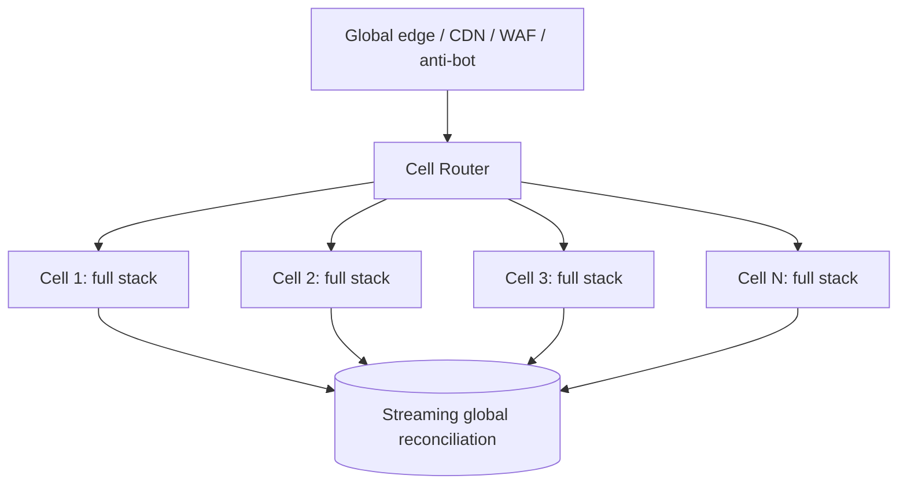

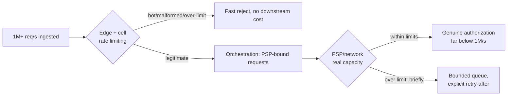

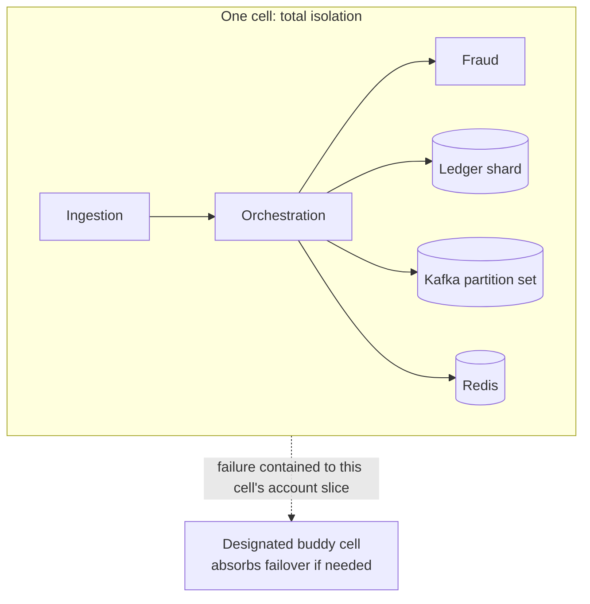

## 8. Closing: Capacity Planning, Topic Index, and Review Checklist

### 8.1 The journey in one table

| Stage | RPS | Architecture | Database | New this stage |
| --- | --- | --- | --- | --- |
| 1 | 1 | Modular monolith, single instance | Single Postgres | Idempotency contract, ledger schema, tokenized cards |
| 2 | 10 | Monolith, 2–3 instances behind LB | Postgres Multi-AZ, HikariCP tuned | Resilience4j retry/circuit breaker, PCI scoping, audit log |
| 3 | 100 | Monolith, enforced module boundaries | Primary + read replicas, indexing/partitioning | Redis cache, rate limiting, replica-aware routing |
| 4 | 1,000 | Monolith + API gateway | PgBouncer, partitioned tables | Kafka via transactional outbox, async webhooks, Kubernetes |
| 5 | 10,000 | Microservices (6+ services) | Per-service DBs, ledger sharded | Sagas, CQRS, service mesh, distributed tracing |
| 6 | 100,000 | Multi-region, active-active | Regionally-sharded ledger | Global routing, PSP multiplexing, dedicated fraud-inference tier |
| 7 | 1,000,000 | Cell-based, per-region | Per-cell shards | Edge shielding, backpressure propagation, blast-radius isolation |

A rough, deliberately conservative capacity rule of thumb used throughout: a well-tuned Spring Boot instance on modern hardware, doing real work (DB round trip + one external call), comfortably serves low-hundreds of RPS before p99 latency degrades — so every order-of-magnitude jump in this document is a jump in *instance count and architecture*, not in per-instance efficiency alone. Treat every specific number in this document (RPS thresholds, timeout values, pool sizes) as an illustrative starting point for load testing against your actual workload, not a guarantee.

### 8.2 Topic coverage index

| Topic | Primary stage(s) |
| --- | --- |
| Monolith → modular monolith → microservices | 1, 3, 5 |
| Vertical vs. horizontal scaling | 1–2 (vertical headroom), 4–7 (horizontal) |
| Load balancers and API gateways | 2 (LB), 4 (gateway) |
| Stateless Spring Boot services | 2 |
| Connection pooling (HikariCP, PgBouncer) | 2, 4 |
| PostgreSQL/MySQL limitations and scaling | 1, 3 |
| Read replicas | 3 |
| Database indexing and partitioning | 3, 4 |
| Caching with Redis | 3 |
| Idempotency and duplicate payment prevention | 1, 4, 5, 7 |
| Distributed locking and why to avoid it | 1 (unique constraint instead), 3 (Redis counters, not locks) |
| Message queues (Kafka/RabbitMQ/SQS) | 4, 5, 6 |
| Event-driven architecture | 4, 5 |
| CQRS | 5 |
| Async processing for non-critical flows | 4 |
| Synchronous vs. asynchronous payment paths | 0, 1, 4, 5 |
| Rate limiting and backpressure | 3, 7 |
| Circuit breakers, retries, timeouts, bulkheads | 2, 4, 6 |
| Service discovery | 5 |
| Kubernetes-based deployment | 4, 5, 7 |
| Observability: metrics, logs, traces, alerts | 2, 3, 5, 7 |
| PCI-DSS / security considerations | 1, 2, 5 |
| Tokenization of card data | 1 |
| Encryption, secrets management, audit logging | 2, 6 |
| Multi-region architecture | 6 |
| Active-active vs. active-passive | 5, 6 |
| Disaster recovery and failover | 5, 6 |
| Handling external payment provider limits | 0, 6, 7 |
| Exactly-once vs. at-least-once processing | 0, 4 |
| Ledger consistency and reconciliation | 1, 3, 5, 7 |
| Fraud/risk engine scaling | 2, 5, 6 |
| Webhook delivery at scale | 4, 6, 7 |
| Load testing and capacity planning | 7, 8.1 |

### 8.3 Staff-level review checklist

Before treating any stage's design as "done," a useful gut-check: does the idempotency story hold under concurrent retries at this stage's target RPS, not just in the happy path; does the ledger's double-entry invariant get verified by an automated job, not just trusted; is there a documented, tested answer for "what happens when the PSP is slow" and "what happens when the PSP is down"; can this stage's design be explained without saying "and then it just scales"; and does moving to the next stage solve a bottleneck that's actually been observed (or rigorously modeled), rather than one that's merely anticipated. The six planes from the foundational framing — ingestion, orchestration, ledger, settlement, reconciliation, notification — should be traceable in every stage's design: which planes are fused, which are separated, and why, at that specific point in the journey.
