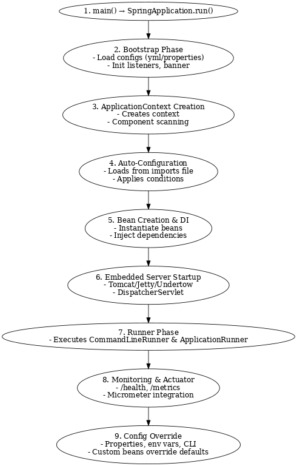

# Basic Spring Boot

---

## 1. What is Spring Boot and why use it over plain Spring?

- Spring Boot is an opinionated framework built on top of Spring that makes it easier to develop, test, and deploy applications by reducing boilerplate configuration and providing production-ready features out of the box.  
- Unlike plain Spring, where developers had to manually configure beans, XML, application servers, and dependencies, Spring Boot provides auto-configuration, starters, and embedded servers to drastically simplify setup. This makes it ideal for building microservices and cloud-native applications.

## Key Features of Spring Boot

- Auto-Configuration – Configures beans automatically based on dependencies (e\.g\., DataSource, JPA, Jackson).
- Starters – Predefined dependency bundles like spring-boot-starter-web, spring-boot-starter-data-jpa, reducing version conflicts.
- Embedded Servers – Built-in Tomcat, Jetty, or Undertow → no need for external deployment.
- Actuator – Production-ready endpoints for health, metrics, logging, and monitoring.
- CLI Support – Quickly prototype apps using Groovy.
- Cloud-native Support – Works seamlessly with Docker, Kubernetes, and Spring Cloud.

---

## Advantages of Spring Boot

- Reduces boilerplate code → less setup, faster development.
- Boosts productivity with sensible defaults and auto-config.
- Microservices ready → lightweight, container-friendly, and fast to deploy.
- Strong Spring integration → works seamlessly with Spring Security, Spring Data, Spring Cloud.
- Production-ready monitoring via Actuator + Micrometer.
- Security built-in → easy integration with OAuth2, JWT, etc.

---

## Key Components of Spring Boot

1\. Starters – Simplify dependency management.  
2\. Auto-Configuration – Automatically configures application context.  
3\. CLI – Command-line tool for quick app prototyping.  
4\. Actuator – Exposes operational endpoints for monitoring and management.  
5\. \(Optional\) Spring Initializr – Online tool to bootstrap projects quickly.

---

## 2. Why prefer Spring Boot over Spring?

- Plain Spring requires manual configuration, XML, and external server setup.
- Spring Boot minimizes manual effort with auto-config, embedded servers, and starter dependencies.
- Offers production-ready features like health checks, metrics, and monitoring by default.
- Greatly reduces development time and learning curve while accelerating microservices adoption.

**Example:**  
"In my payments API project, Spring Boot allowed us to build microservices quickly using starters for Web, JPA, and Security. We embedded Tomcat for standalone deployment, exposed health checks with Actuator for Kubernetes readiness probes, and integrated monitoring with Prometheus. Compared to plain Spring, setup and deployment time was reduced by more than half."

---

## 3. Explain the internal working of Spring Boot.

### 1\. Application startup

- When we run a Spring Boot app, the main method calls SpringApplication.run().
- This bootstraps the Spring ApplicationContext, loads beans, applies auto-configuration, and starts the embedded server \(Tomcat/Jetty/Undertow\).

### 2\. Auto-Configuration mechanism

- Spring Boot uses @SpringBootApplication, which is a combination of:
    - @Configuration – marks the class as a configuration source.
    - @EnableAutoConfiguration – enables auto-configuration based on classpath.
    - @ComponentScan – scans for components/services/repos.
- Auto-configuration classes are loaded from META-INF/spring/org.springframework.boot.autoconfigure.AutoConfiguration.imports.
- Each config class is guarded by conditions (@ConditionalOnClass, @ConditionalOnMissingBean, @ConditionalOnProperty).
- This ensures only relevant beans are created depending on what’s on the classpath.

### 3\. Starters and Dependency Management

- Spring Boot provides starter dependencies \(spring-boot-starter-web, spring-boot-starter-data-jpa\).
- These bring in the right versions of libraries, avoiding dependency conflicts.
- Spring Boot manages versions using a BOM \(Bill of Materials\).

### 4\. Embedded Server

- Boot embeds Tomcat/Jetty/Undertow.
- At startup, Spring Boot automatically creates and starts the server instance.
- This allows apps to be packaged as runnable JARs → no need for external deployment.

### 5\. Externalized Configuration

- Configurations are loaded from multiple sources in priority order:
    - Command-line args → environment variables → application.yml/properties → defaults.
- Bound to POJOs via @ConfigurationProperties.

### 6\. Monitoring and Management

- Spring Boot Actuator provides endpoints \(/health, /metrics, /info\) for monitoring.
- Uses Micrometer to integrate with tools like Prometheus, Grafana, or ELK stack.

### 7\. Customization and Override

- Developers can override auto-config by:
    - Defining their own beans \(which replace Boot’s defaults\).
    - Disabling specific auto-config classes via exclude attribute.
    - Changing values in application.yml or application.properties.

**Example \(Banking Domain\):**  
“In a loan processing system, when we used spring-boot-starter-data-jpa, Spring Boot auto-configured Hibernate, DataSource, and TransactionManager for us. By just adding application.yml with DB credentials, the app connected to Oracle DB. At runtime, Boot started embedded Tomcat, auto-wired our controllers and services, and exposed /actuator/health for monitoring in Kubernetes.”

---

### INTERNAL WORKING



Main() → SpringApplication → Context → Auto-config → Beans → Embedded Server → Runners → Actuator.

---

### Application Lifecycle Steps

1\. **Application Entry Point**
- App starts with public static void main() → SpringApplication.run(App.class, args).
- Creates and configures the SpringApplication instance.

---

2\. **Bootstrap Phase**
- Environment prepared: loads configs from application.yml, system properties, env variables.
- Listeners and initializers run.
- Logs startup banner.

---

3\. **Application Context Creation**
- Creates ApplicationContext \(e.g., AnnotationConfigServletWebServerApplicationContext for web apps\).
- Registers beans and scans components (@ComponentScan).

---

4\. **Auto-Configuration**
- Enabled by @EnableAutoConfiguration inside @SpringBootApplication.
- Loads config classes from META-INF/spring/org.springframework.boot.autoconfigure.AutoConfiguration.imports.
- Applies conditions (@ConditionalOnClass, @ConditionalOnMissingBean, etc.) to decide what beans to load.

---

5\. **Bean Creation & Dependency Injection**
- Beans from user code + auto-config are instantiated.
- Dependencies injected via constructor/field/setter.
- Lifecycle callbacks executed (@PostConstruct, InitializingBean).

---

6\. **Embedded Server Startup \(for web apps\)**
- Spring Boot creates and starts an embedded server \(Tomcat/Jetty/Undertow\).
- DispatcherServlet registered to handle requests.

---

7\. **Application Runner Phase**
- Executes CommandLineRunner and ApplicationRunner beans if present.
- Now the app is fully up and running.

---

8\. **Monitoring & Actuator \(if enabled\)**
- Actuator endpoints exposed \(/actuator/health, /actuator/metrics\).
- Metrics collected via Micrometer and exported to tools like Prometheus, Grafana.

---

9\. **Externalized Config Override**
- Any property from CLI, env vars, or configs can override defaults.
- Custom beans replace Boot defaults if defined by the user.

---

**Example \(Banking Domain Flow\):**

“In our Payments API, the lifecycle was:  
1\. SpringApplication.run() bootstrapped the app.  
2\. Auto-config detected spring-boot-starter-data-jpa → created DataSource + EntityManager.  
3\. Embedded Tomcat started on port 8080.  
4\. Our controllers were registered by @ComponentScan.  
5\. Actuator exposed /actuator/health for Kubernetes readiness checks.  
This entire flow required almost no XML configuration.”

---

## 10. What are the Spring Boot Starter Dependencies?

- Spring Boot Starters are predefined dependency descriptors that simplify dependency management.
- Instead of manually adding multiple libraries to pom.xml \(Maven\) or build.gradle \(Gradle\), starters group them together for specific functionality.

---

### Why They’re Needed

1\. Reduce boilerplate in dependency management.  
2\. Ensure version compatibility between libraries.  
3\. Faster setup for common application use cases.  
4\. Standardizes project structure across teams.

---

### How They Work

- Each starter is basically a Maven/Gradle dependency maintained by Spring Boot.
- When added, it pulls in all transitive dependencies required for that feature.
- Example: spring-boot-starter-web automatically brings in:
    - Spring MVC
    - Jackson \(for JSON processing\)
    - Validation API
    - An embedded Tomcat server

---

### Commonly Used Spring Boot Starters

#### 1\. Core Starters

- spring-boot-starter → Core starter, auto-configuration, logging, YAML support.
- spring-boot-starter-test → JUnit, Mockito, Hamcrest for testing.

#### 2\. Web Starters

- spring-boot-starter-web → For RESTful apps using Spring MVC with Tomcat.
- spring-boot-starter-webflux → For reactive apps using Spring WebFlux with Netty.

#### 3\. Data Access Starters

- spring-boot-starter-data-jpa → JPA + Hibernate.
- spring-boot-starter-data-mongodb → MongoDB.
- spring-boot-starter-jdbc → JDBC with HikariCP connection pool.

#### 4\. Security & Validation

- spring-boot-starter-security → Spring Security.
- spring-boot-starter-validation → Hibernate Validator.

#### 5\. Messaging & Integration

- spring-boot-starter-amqp → RabbitMQ.
- spring-boot-starter-data-redis → Redis.

#### 6\. Other Starters

- spring-boot-starter-thymeleaf → Template engine support.
- spring-boot-starter-actuator → Monitoring, health checks, metrics.

---

### Advantages of Using Starters

- Less manual dependency management.
- Compatible versions guaranteed by Spring Boot’s parent POM.
- Quick project setup for microservices.

---

## 9. How does a Spring application get started?

### 1\. Main Class with @SpringBootApplication

- You define a main class with the @SpringBootApplication annotation.
- Example:

```java
@SpringBootApplication
public class MyApplication {
    public static void main(String[] args) {
        SpringApplication.run(MyApplication.class, args);
    }
}
```

### 2\. SpringApplication.run() is Called

- Internally it bootstraps the Spring context, applies auto-configuration, refreshes the context, and finally starts the embedded server.
- This is the entry point.
- What it does:
    - Creates a SpringApplication instance.
    - Starts the Spring context \(IoC container\).
    - Triggers auto-configuration.
    - Starts the embedded server \(Tomcat/Jetty/Netty\).

---

### 3\. Auto-Configuration Kicks In

- @SpringBootApplication is actually a combination of:
    - @Configuration → Marks this as a configuration class.
    - @EnableAutoConfiguration → Enables auto-configuration.
    - @ComponentScan → Scans for beans in the package and subpackages.
- Spring Boot checks spring.factories files \(inside jars\) for configurations and loads them automatically \(e.g., web, data, security\).

---

### 4\. Beans Are Created and Wired

- Spring scans the classpath, finds components (@Component, @Service, @Repository, @Controller).
- Beans are created and dependencies are injected.

---

### 5\. Embedded Server Starts

- If spring-boot-starter-web is present:
    - Spring Boot will auto-configure Tomcat as the web server.
    - It binds the server to a port \(default: 8080\).
    - If it’s a reactive app, Netty starts instead.

---

### 6\. Application Context Ready

- The ApplicationContext \(IoC container\) is fully initialized.
- Any CommandLineRunner or ApplicationRunner beans are executed.

---

### 7\. Application is Live

- The application is now running and listening for requests.
- You can hit APIs or access web endpoints.

---

## 9. What does @SpringBootApplication do internally?

The @SpringBootApplication is a meta-annotation introduced in Spring Boot that combines three key annotations and configures the application automatically.

---

### 1\. Meta-Annotation

- @SpringBootApplication =  
  @Configuration + @EnableAutoConfiguration + @ComponentScan

---

### 2\. Breakdown of Each Annotation

#### @Configuration

- Marks the class as a source of bean definitions.
- Equivalent to a Spring XML configuration file.
- Allows us to use @Bean methods inside this class.

#### @EnableAutoConfiguration

- Tells Spring Boot to enable auto-configuration.
- Reads META-INF/spring.factories \(or spring/org.springframework.boot.autoconfigure.AutoConfiguration.imports in newer versions\).
- Based on classpath dependencies \(e.g., spring-boot-starter-data-jpa, spring-boot-starter-web\), it auto-configures beans like:
    - DispatcherServlet
    - DataSource
    - EntityManagerFactory
    - MessageConverters

#### @ComponentScan

- Scans the current package and sub-packages for components:
    - @Component
    - @Service
    - @Repository
    - @Controller
- Registers them as beans in the Spring container.

---

### 3\. How It Works Internally

1\. You annotate your main class with @SpringBootApplication.  
2\. When you run SpringApplication.run(...), Spring:
- Creates an ApplicationContext.
- Loads beans from the configuration (@Configuration).
- Auto-configures beans (@EnableAutoConfiguration) depending on libraries in the classpath.
- Scans and registers beans in your package (@ComponentScan).
  3\. End result → A fully configured Spring Boot application with minimal manual setup.

---

### 4\. Key Points for Interviews

- @SpringBootApplication is just a shortcut annotation.
- Helps reduce boilerplate \(no need to separately use 3 annotations\).
- Auto-configuration uses conditional classes (@ConditionalOnClass, @ConditionalOnMissingBean).
- Best practice: Place the @SpringBootApplication class in the root package.

---

## 10. What is Spring Initializr?

Spring Initializr is a website that helps us to start a new Spring Boot project quickly. We choose our project settings, like dependencies and configurations, using an easy interface. Then, it creates a ready-to-use project that we can download or import into our development tool, making it faster and easier to get started.

---

## 11. What is a Spring Bean?

A Spring Bean is an object managed by the Spring framework. The framework creates, configures, and connects these beans for us, making it easier to manage dependencies and the lifecycle of objects. Beans can be set up using simple annotations or XML files, helping us build our application in a more organized and flexible way.

---

## 12. What is Auto-wiring?

Auto-wiring in Spring automatically connects beans to their needed dependencies without manual setup. It uses annotations or XML to find and link beans based on their type or name. This makes it easier and faster to develop applications by reducing the amount of code we need to write for connecting objects.

---

## 13. What is ApplicationRunner in SpringBoot?

ApplicationRunner in Spring Boot lets us run code right after the application starts. We create a class that implements the run method with our custom logic. This code runs automatically when the app is ready. It's useful for tasks like setting up data or resources, making it easy to perform actions as soon as the application launches.

---

## 14. What is CommandLineRunner in SpringBoot?

CommandLineRunner and ApplicationRunner in Spring Boot both let us run code after the application starts, but they differ slightly. CommandLineRunner uses a run method with a String array of arguments, while ApplicationRunner uses an ApplicationArguments object for more flexible argument handling.

---

## 15. What is Spring Boot CLI and the most used CLI commands?

Spring Boot CLI \(Command Line Interface\) helps us quickly create and run Spring applications using simple scripts. It makes development easier by reducing setup and configuration. Common commands are ‘spring init’ to start a new project, ‘spring run’ to run scripts, ‘spring test’ to run tests, and ‘spring install’ to add libraries. These commands make building and testing Spring apps faster and simpler.

---

## 16. What is Spring Boot dependency management?

Spring Boot dependency management makes it easier to handle the dependencies that our project depends on. Instead of manually keeping track of them, Spring Boot helps us manage them automatically. It uses tools like Maven or Gradle to organize these dependencies, making sure they work well together. This saves developers time and effort and allowing us to focus on writing their own code without getting bogged down in managing dependencies.

---

## 17. Is it possible to change the port of the embedded Tomcat server in Spring Boot?

Yes, we can change the default port of the embedded Tomcat server in Spring Boot. This can be done by setting the server.port property in the application.properties or application.yml file to the desired port number.

---

## 18. What happens if a starter dependency includes conflicting versions of libraries with other dependencies in the project?

If a starter dependency includes conflicting versions of libraries with other dependencies, Spring Boot's dependency management resolves this by using a concept called "dependency resolution." It ensures that only one version of each library is included in the final application, prioritizing the most compatible version. This helps prevent runtime errors caused by conflicting dependencies and ensures the smooth functioning of the application.

---

## 19. What is the default port of Tomcat in Spring Boot?

The default port for Tomcat in Spring Boot is 8080. This means when a Spring Boot application with an embedded Tomcat server is run, it will, by default, listen for HTTP requests on port 8080 unless configured otherwise.

---

## 20. Can we disable the default web server in a Spring Boot application?

Yes, we can disable the default web server in a Spring Boot application by setting the spring.main.web-application-type property to none in our application.properties or application.yml file. This will result in a non-web application, suitable for messaging or batch processing jobs.

---

## 21. How to disable a specific auto-configuration class?

We can disable specific auto-configuration classes in Spring Boot by using the exclude attribute of the @EnableAutoConfiguration annotation or by setting the spring.autoconfigure.exclude property in our application.properties or application.yml file.

---

## 22. Can we create a non-web application in Spring Boot?

Absolutely, Spring Boot is not limited to web applications. We can create standalone, non-web applications by disabling the web context. This is done by setting the application type to 'none', which skips the setup of web-specific contexts and configurations.

---

## 23. Describe the flow of HTTPS requests through a Spring Boot application.

In a Spring Boot application, HTTPS requests first pass through the embedded server's security layer, which manages SSL/TLS encryption. Then, the requests are routed to appropriate controllers based on URL mappings. Controllers process the requests, possibly invoking services for business logic, and return responses, which are then encrypted by the SSL/TLS layer before being sent back to the client.

---

## 24. Explain @RestController annotation in Spring Boot.

The @RestController annotation in Spring Boot is used to create RESTful web controllers. This annotation is a convenience annotation that combines @Controller and @ResponseBody, which means the data returned by each method will be written directly into the response body as JSON or XML, rather than through view resolution.

---

## 25. Difference between @Controller and @RestController

The key difference is that @Controller is used to mark classes as Spring MVC Controller and typically return a view. @RestController combines @Controller and @ResponseBody, indicating that all methods assume @ResponseBody by default, returning data instead of a view.

---

## 26. What is the difference between RequestMapping and GetMapping?

@RequestMapping is a general annotation that can be used for routing any HTTP method requests \(like GET, POST, etc.\), requiring explicit specification of the method. @GetMapping is a specialized version of @RequestMapping that is designed specifically for HTTP GET requests, making the code more readable and concise.

---

## 27. What are the differences between @SpringBootApplication and @EnableAutoConfiguration annotation?

The @SpringBootApplication annotation is a convenience annotation that combines @Configuration, @EnableAutoConfiguration, and @ComponentScan annotations. It is used to mark the main class of a Spring Boot application and trigger auto-configuration and component scanning. On the other hand, @EnableAutoConfiguration specifically enables Spring Boot's auto-configuration mechanism, which attempts to automatically configure our application based on the jar dependencies we have added. It is included within @SpringBootApplication.

---

## 28. How can you programmatically determine which profiles are currently active in a Spring Boot application?

In a Spring Boot application, we can find out which profiles are active by using a tool called Environment. First, we include Environment in our code using @Autowired, which automatically fills it with the right information. Then, we use the getActiveProfiles() method of Environment to get a list of all the active profiles. This method gives us the names of these profiles as a simple array of strings.

```java
@Autowired
Environment env;
String[] activeProfiles = env.getActiveProfiles();
```

---

## 29. Mention the differences between WAR and embedded containers.

Traditional WAR deployment requires a standalone servlet container like Tomcat, Jetty, or WildFly. In contrast, Spring Boot with an embedded container allows us to package the application and the container as a single executable JAR file, simplifying deployment and ensuring that the environment configurations remain consistent.

---

## 30. What is Spring Boot Actuator?

Spring Boot Actuator provides production-ready features to help monitor and manage our application. It includes a number of built-in endpoints that provide vital operational information about the application \(like health, metrics, info, dump, env, etc.\) which can be exposed via HTTP or JMX.

---

## 31. How to enable Actuator in Spring Boot?

To enable Spring Boot Actuator, we simply add the spring-boot-starter-actuator dependency to our project’s build file. Once added, we can configure its endpoints and their visibility properties through the application properties or YAML configuration file.

---

## 32. How to get the list of all the beans in our Spring Boot application?

To list all the beans loaded by the Spring ApplicationContext, we can inject the ApplicationContext into any Spring-managed bean and call the getBeanDefinitionNames() method. This will return a String array containing the names of all beans managed by the context.

---

## 33. Can we check the environment properties in our Spring Boot application? Explain how.

Yes, we can access environment properties in Spring Boot via the Environment interface. Inject the Environment into a bean using the @Autowired annotation and use the getProperty() method to retrieve properties.

**Example:**

```java
@Autowired
private Environment env;
String dbUrl = env.getProperty("database.url");
System.out.println("Database URL: " + dbUrl);
```

---

## 34. How to enable debugging log in the Spring Boot application?

To enable debugging logs in Spring Boot, we can set the logging level to DEBUG in the application.properties or application.yml file by adding a line such as logging.level.root=DEBUG. This will provide detailed logging output, useful for debugging purposes.

---

## 35. Explain the need of dev-tools dependency.

The dev-tools dependency in Spring Boot provides features that enhance the development experience. It enables automatic restarts of our application when code changes are detected, which is faster than restarting manually. It also offers additional development-time checks to help us catch common mistakes early.

---

## 36. How do you test a Spring Boot application?

To test a Spring Boot application, we use different tools and annotations. For testing the whole application together, we use @SpringBootTest. When we want to test just a part of our application, like the web layer, we use @WebMvcTest. If we are testing how our application interacts with the database, we use @DataJpaTest. Tools like JUnit help us check if things are working as expected, and Mockito lets us replace some parts with dummy versions to focus on what we are testing.

---

## 37. What is the purpose of unit testing in software development?

Unit testing is a way to check if small parts of a program work as they should. It helps find mistakes early, making it easier to fix them and keep the program running smoothly. This makes the software more reliable and easier to update later.

---

## 38. How do JUnit and Mockito facilitate unit testing in Java projects?

JUnit and Mockito are tools that help test small parts of Java programs. JUnit lets us check if each part works right, while Mockito lets us create fake versions of parts we are not testing. This way, we can focus on testing one thing at a time.

---

## 39. Explain the difference between @Mock and @InjectMocks in Mockito.

In Mockito, @Mock is used to create a fake version of an object to test it without using the real one. @InjectMocks is used to put these fake objects into the class we are testing. This helps us see how our class works with the fakes, making sure everything fits together correctly.

---

## 40. What is the role of @SpringBootTest annotation?

The @SpringBootTest annotation in Spring Boot is used for integration testing. It loads the entire application context to ensure that all the components of the application work together as expected. This is helpful for testing the application in an environment similar to the production setup, where all parts \(like databases and internal services\) are active, allowing developers to detect and fix integration issues early in the development process.

---

## 41. How do you handle exceptions in Spring Boot applications?

In Spring Boot, I handle errors by creating a special class with @ControllerAdvice or @RestControllerAdvice. This class has methods marked with @ExceptionHandler that deal with different types of errors. These methods help make sure that when something goes wrong, my application responds in a helpful way, like sending a clear error message or a specific error code.

---

## 42. Explain the purpose of the pom.xml file in a Maven project.

The pom.xml file in a Maven project is like a recipe that tells Maven how to build and manage the project. It lists the ingredients \(dependencies like libraries and tools\) and instructions \(like where files are and how to put everything together\). This helps Maven automatically handle tasks like building the project and adding the right libraries, making developers' work easier.

---

## 43. How auto configuration play an important role in springboot application?

Auto-configuration in Spring Boot makes setting up applications easier by automatically setting up parts of the system. For example, if it sees that we have a database tool added, it will set up the database connection for us. This means we spend less time on setting up and more on creating the actual features of our application.

---

## 44. Can we customize a specific auto-configuration in springboot?

Yes, in Spring Boot, we can customize specific auto-configurations. Although Spring Boot automatically sets up components based on our environment, we can override these settings in our application properties or YAML file, or by adding our own configuration beans. We can also use the @Conditional annotation to include or exclude certain configurations under specific conditions. This flexibility allows us to tailor the auto-configuration to better fit our application’s specific needs.

---

## 45. How can you disable specific auto-configuration classes in Spring Boot?

We can disable specific auto-configuration classes in Spring Boot by using the @SpringBootApplication annotation with the exclude attribute. For example, @SpringBootApplication(exclude = {DataSourceAutoConfiguration.class}) will disable the DataSourceAutoConfiguration class. Alternatively, we can use the spring.autoconfigure.exclude property in our application.properties or application.yml file to list the classes we want to exclude.

---

## 46. What is the purpose of having a spring-boot-starter-parent?

The spring-boot-starter-parent in a Spring Boot project provides a set of default configurations for Maven. It simplifies dependency management, specifies common properties like Java version, and includes useful plugins. This parent POM ensures consistent versions of dependencies and plugins, reducing the need for manual configuration and helping maintain uniformity across Spring Boot projects.

---

## 47. How do starters simplify the Maven or Gradle configuration?

Starters in Maven or Gradle simplify configuration by bundling common dependencies into a single package. Instead of manually specifying each dependency for a particular feature \(like web development or JPA\), we can add a starter \(e.g., spring-boot-starter-web\), which includes all necessary libraries. This reduces configuration complexity, ensures compatibility, and speeds up the setup process, allowing developers to focus more on coding and less on dependency management.

---

## 48. How do you create REST APIs?

To create REST APIs in Spring Boot, I annotate my class with @RestController and define methods with @GetMapping, @PostMapping, @PutMapping, or @DeleteMapping to handle HTTP requests. I Use @RequestBody for input data and @PathVariable or @RequestParam for URL parameters. I Implement service logic and return responses as Java objects, which Spring Boot automatically converts to JSON. This setup handles API endpoints for CRUD operations.

---

## 49. What is versioning in REST? What are the ways that we can use to implement versioning?

Versioning in REST APIs helps manage changes without breaking existing clients. It allows different versions of the API to exist at the same time, making it easier for clients to upgrade gradually.  
We can version REST APIs in several ways: include the version number in the URL \(e.g., /api/v1/resource\), add a version parameter in the URL \(e.g., /api/resource?version=1\), use custom headers to specify the version \(e.g., Accept: application/vnd.example.v1+json\), or use media types for versioning \(e.g., application/vnd.example.v1+json\).

---

## 50. What are the REST API Best practices?

Best practices for REST APIs are using the right HTTP methods \(GET, POST, PUT, DELETE\), keeping each request independent \(stateless\), naming resources clearly, handling errors consistently with clear messages and status codes, using versioning to manage updates, securing APIs with HTTPS and input validation, and using pagination for large datasets to make responses manageable.

---

## 51. What are the uses of ResponseEntity?

ResponseEntity in Spring Boot is used to customize responses. It lets us set HTTP status codes, add custom headers, and return response data as Java objects. This flexibility helps create detailed and informative responses. For example, new ResponseEntity<>("Hello, World!", HttpStatus.OK) sends back "Hello, World!" with a status code of 200 OK.

---

## 52. What should the delete API method status code be?

The DELETE API method should typically return a status code of 200 OK if the deletion is successful and returns a response body, 204 No Content if the deletion is successful without a response body, or 404 Not Found if the resource to be deleted does not exist.

---

## 53. What is swagger?

Swagger is an open-source framework for designing, building, and documenting REST APIs. It provides tools for creating interactive API documentation, making it easier for developers to understand and interact with the API.

---

## 54. How does Swagger help in documenting APIs?

Swagger helps document APIs by providing a user-friendly interface that displays API endpoints, request/response formats, and available parameters. It generates interactive documentation from API definitions, allowing developers to test endpoints directly from the documentation and ensuring accurate, up-to-date API information.

---

## 55. What all servers are provided by springboot and which one is default?

Spring Boot provides several embedded servers, including Tomcat, Jetty, and Undertow. By default, Spring Boot uses Tomcat as the embedded server unless another server is specified.

---

## 56. How does Spring Boot decide which embedded server to use if multiple options are available in the classpath?

Spring Boot decides which embedded server to use based on the order of dependencies in the classpath. If multiple server dependencies are present, it selects the first one found. For example, if both Tomcat and Jetty are present, it will use the one that appears first in the dependency list.

---

## 57. How can we disable the default server and enable the different one?

To disable the default server and enable a different one in Spring Boot, exclude the default server dependency in the pom.xml or build.gradle file and add the dependency for the desired server. For example, to switch from Tomcat to Jetty, exclude the Tomcat dependency and include the Jetty dependency in our project configuration.

---

# Spring Boot Important Annotations

---

1\. **@SpringBootApplication:** This is a one of the annotations that combines @Configuration, @EnableAutoConfiguration, and @ComponentScan annotations with their default attributes. \(Explained below\)  
2\. **@EnableAutoConfiguration:** The @EnableAutoConfiguration annotation in Spring Boot tells the framework to automatically configure our application based on the libraries we have included. This means Spring Boot can set up our project with the default settings that are most likely to work well for our setup.  
3\. **@Configuration:** The @Configuration annotation in Spring marks a class as a source of bean definitions for the application context. It tells Spring that the class can be used to define and configure beans, which are managed components of a Spring application, facilitating dependency injection and service orchestration.  
4\. **@ComponentScan:** The @ComponentScan annotation in Spring tells the framework  
5\. **@Bean:** where to look for components, services, and configurations. It automatically discovers and registers beans in the specified packages, eliminating the need for manual bean registration and making it easier to manage and scale the application's architecture.  
The @Bean annotation in Spring marks a method in a configuration class to define a bean. This bean is then managed by the Spring container, which handles its lifecycle and dependencies. The @Bean annotation is used to explicitly create and configure beans that Spring should manage.  
6\. **@Component:** The @Component annotation in Spring marks a class as a Spring-managed component. This allows Spring to automatically detect and register the class as a bean in the application context, enabling dependency injection and making the class available for use throughout the application.  
7\. **@Repository:** The @Repository annotation in Spring marks a class as a data access component, specifically for database operations. It provides additional benefits like exception translation, making it easier to manage database access and integrate with Spring's data access framework.  
8\. **@Service:** The @Service annotation in Spring marks a class as a service layer component, indicating that it holds business logic. It is used to create Spring-managed beans, making it easier to organize and manage services within the application.  
**Cross-Question:** Can we use @Component instead of @Repository and @Service? If yes then why do we use @Repository and @Service?  
Yes, we can use @Component instead of @Repository and @Service since all three create Spring beans. However, @Repository and @Service make our code clearer by showing the purpose of each class. @Repository also helps manage database errors better. Using these specific annotations makes our code easier to understand and maintain.  
9\. **@Controller:** The @Controller annotation in Spring marks a class as a web controller that handles HTTP requests. It is used to define methods that respond to web requests, show web pages, or return data, making it a key part of Spring's web application framework.  
10\. **@RestController:** The @RestController annotation in Spring marks a class as a RESTful web service controller. It combines @Controller and @ResponseBody, meaning the methods in the class automatically return JSON or XML responses, making it easy to create REST APIs.  
11\. **@RequestMapping:** The @RequestMapping annotation in Spring maps HTTP requests to handler methods in controller classes. It specifies the URL path and the HTTP method \(GET, POST, etc.\) that a method should handle, enabling routing and processing of web requests in a Spring application.  
12\. **@Autowired:** The @Autowired annotation in Spring enables automatic dependency injection. It tells Spring to automatically find and inject the required bean into a class, reducing the need for manual wiring and simplifying the management of dependencies within the application.  
13\. **@PathVariable:** The @PathVariable annotation in Spring extracts values from URI templates and maps them to method parameters. It allows handlers to capture dynamic parts of the URL, making it possible to process and respond to requests with path-specific data in web applications.  
14\. **@RequestParam:** The @RequestParam annotation in Spring binds a method parameter to a web request parameter. It extracts query parameters, form data, or any parameters in the request URL, allowing the handler method to process and use these values in the application.  
15\. **@ResponseBody:** The @ResponseBody annotation in Spring tells a controller method to directly return the method's result as the response body, instead of rendering a view. This is commonly used for RESTful APIs to send data \(like JSON or XML\) back to the client.  
16\. **@RequestBody:** The @RequestBody annotation in Spring binds the body of an HTTP request to a method parameter. It converts the request body into a Java object, enabling the handling of data sent in formats like JSON or XML in RESTful web services.  
17\. **@EnableWebMvc:** The @EnableWebMvc annotation in Spring activates the default configuration for Spring MVC. It sets up essential components like view resolvers, message converters, and handler mappings, providing a base configuration for building web applications.  
18\. **@EnableAsync:** The @EnableAsync annotation in Spring enables asynchronous method execution. It allows methods to run in the background on a separate thread, improving performance by freeing up the main thread for other tasks.  
19\. **@Scheduled:** The @Scheduled annotation in Spring triggers methods to run at fixed intervals or specific times. It enables scheduling tasks automatically based on cron expressions, fixed delays, or fixed rates, facilitating automated and timed execution of methods.  
20\. **@EnableScheduling:** @EnableScheduling is an annotation in Spring Framework used to enable scheduling capabilities for methods within a Spring application. It allows methods annotated with @Scheduled to be executed based on specified time intervals or cron expressions.

---
