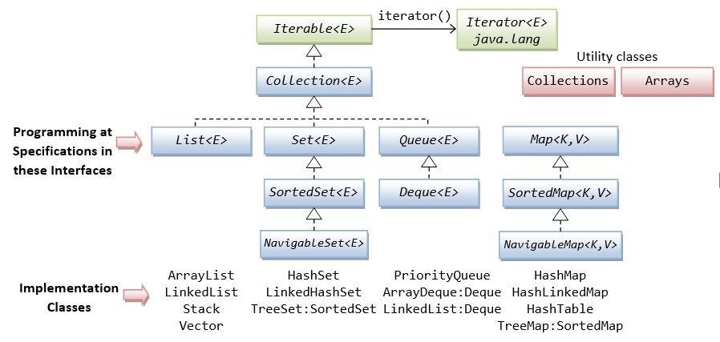
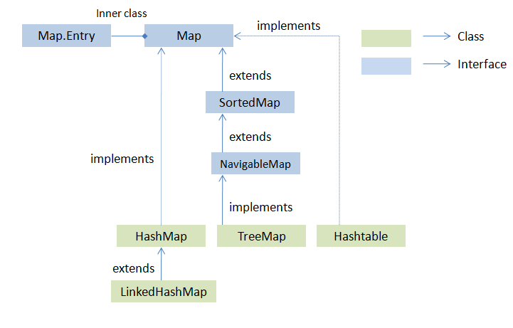
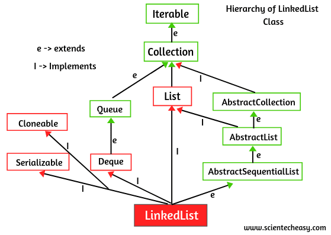
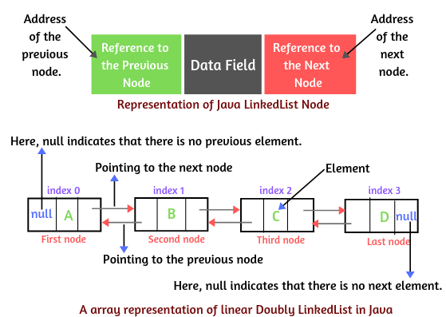
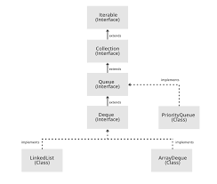

`ROADMAP`


✅ 6. Java 8+ Enhancements
* Streams API:
* filter, map, collect, sorted, forEach
* Functional Interfaces: Function, Consumer, Predicate
* Map.forEach, Map.computeIfAbsent(), removeIf() etc.

✅ 7. Comparisons and Custom Sorting
* Comparable<T> vs Comparator<T>
* Lambda expressions for sorting
* Collections.sort(list, comparator)
* TreeMap and TreeSet with custom comparators


✅ 9. Real-World Scenarios & Design
* Which collection to use when?
* Replace List<Optional<T>> with filters
* Use LinkedHashMap for LRU cache
* Choosing the right Set or Map for memory-sensitive or speed-critical applications

---

# Collections Interview Questions

<br/>

## Q. What is Java Collections Framework? List out some benefits of Collections framework?

**Hierarchy of Java Collections Framework**


The Collection in Java is a framework that provides an architecture to store and manipulate the group of objects. Java Collections can achieve all the operations that we perform on a data such as searching, sorting, insertion, manipulation, and deletion.

Java Collection means a single unit of objects. Java Collection framework provides many interfaces (Set, List, Queue, Deque) and classes (ArrayList, Vector, LinkedList, PriorityQueue, HashSet, LinkedHashSet, TreeSet).

**1. Collection Interface**

Collection interface is at the root of the hierarchy. Collection interface provides all general purpose methods which all collections classes must support (or throw UnsupportedOperationException). It extends **Iterable** interface which adds support for iterating over collection elements using the “for-each loop” statement.

**The Java Collections Framework provides the following benefits:**

* Reduces programming effort
* Increases program speed and quality
* Allows interoperability among unrelated APIs
* Reduces effort to learn and to use new APIs
* Reduces effort to design new APIs
* Fosters software reuse

**Methods of Collection Interface**

<table class="alt">
<tbody><tr><th>No.</th><th>Method</th><th>Description</th></tr>
<tr><td>1</td><td>public boolean add(Object element)</td><td> is used to insert an element in this collection.</td></tr>
<tr><td>2</td><td>public boolean addAll(Collection c)</td><td>is used to insert the specified collection elements in the invoking collection.</td></tr>
<tr><td>3</td><td>public boolean remove(Object element)</td><td>is used to delete an element from this collection.</td></tr>
<tr><td>4</td><td>public boolean removeAll(Collection c)</td><td>is used to delete all the elements of specified collection from the invoking collection.</td></tr>
<tr><td>5</td><td>public boolean retainAll(Collection c)</td><td>is used to delete all the elements of invoking collection except the specified collection.</td></tr>
<tr><td>6</td><td>public int size()</td><td>return the total number of elements in the collection.</td></tr>
<tr><td>7</td><td>public void clear()</td><td>removes the total no of element from the collection.</td></tr>
<tr><td>8</td><td>public boolean contains(Object element)</td><td>is used to search an element.</td></tr>
<tr><td>9</td><td>public boolean containsAll(Collection c)</td><td>is used to search the specified collection in this collection.</td></tr>
<tr><td>10</td><td>public Iterator iterator()</td><td>returns an iterator.</td></tr>
<tr><td>11</td><td>public Object[] toArray()</td><td>converts collection into array.</td></tr>
<tr><td>12</td><td>public boolean isEmpty()</td><td>checks if collection is empty.</td></tr>
<tr><td>13</td><td>public boolean equals(Object element)</td><td>matches two collection.</td></tr>
<tr><td>14</td><td>public int hashCode()</td><td>returns the hashcode number for collection.</td></tr>
</tbody></table>


| Feature       | List	 | Set            | 	Queue                                         | Map                                   |
|---------------|-------|----------------|------------------------------------------------|---------------------------------------|
| Order	        | Yes	  | No	            | Yes	                                           | No                                    |
| Duplicates	   | Yes	  | No	            | Yes	                                           | No (Allow duplicate values not keys)  |
| Null Values   | Yes	  | Single Null    | 	Yes (LinkedList Queue). No (Priority Queue).  | Single null key and many null values  |

**Collections Framework Implementation Classes Summary**


## Q. What is the benefit of Generics in Collections Framework?

Generics allow us to provide the type of Object that a collection can contain, so if we try to add any element of other type it throws compile time error. This avoids ClassCastException at Runtime because we will get the error at compilation. Also Generics make code clean since we don’t need to use casting and instanceof operator.

## Q. What is the difference between fail-fast and fail-safe iterator?

**fail-fast Iterator**

`Iterators` in java are used to iterate over the Collection objects.Fail-Fast iterators immediately throw `ConcurrentModificationException` if there is **structural modification** of the collection. Structural modification means adding, removing or updating any element from collection while a thread is iterating over that collection. Iterator on ArrayList, HashMap classes are some examples of fail-fast Iterator.

```java
import java.util.ArrayList;
import java.util.Iterator;
 
public class FailFastIteratorExample 
{       
    public static void main(String[] args) {

        //Creating an ArrayList of integers
        ArrayList<Integer> list = new ArrayList<Integer>();
         
        //Adding elements to list
        list.add(1452);
        list.add(6854);
        list.add(8741);
                 
        //Getting an Iterator from list
        Iterator<Integer> it = list.iterator();
         
        while (it.hasNext()) {
            Integer integer = (Integer) it.next();
            list.add(8457);      //This will throw ConcurrentModificationException
        }
    }   
}
```
Output
```
Exception in thread "main" java.util.ConcurrentModificationException
    at java.util.ArrayList$Itr.checkForComodification(Unknown Source)
    at java.util.ArrayList$Itr.next(Unknown Source)
    at pack1.MainClass.main(MainClass.java:32)
```

**fail-safe Iterator**

Fail-Safe iterators don’t throw any exceptions if a collection is structurally modified while iterating over it. This is because, they operate on the clone of the collection, not on the original collection and that’s why they are called fail-safe iterators. Iterator on CopyOnWriteArrayList, ConcurrentHashMap classes are examples of fail-safe Iterator.

```java
import java.util.Iterator;
import java.util.concurrent.ConcurrentHashMap;
 
public class FailSafeIteratorExample 
{       
    public static void main(String[] args) {

        //Creating a ConcurrentHashMap
        ConcurrentHashMap<String, Integer> map = new ConcurrentHashMap<String, Integer>();
         
        //Adding elements to map
        map.put("ONE", 1);
        map.put("TWO", 2);
        map.put("THREE", 3);
         
        //Getting an Iterator from map
        Iterator<String> it = map.keySet().iterator();
         
        while (it.hasNext()) {
            String key = (String) it.next();
            System.out.println(key+" : "+map.get(key));
            map.put("FOUR", 4); //This will not be reflected in the Iterator
        }
    }   
}
```
Output
```
TWO : 2
FOUR : 4
ONE : 1
THREE : 3
```


## Q. What is difference between Enumeration and Iterator interface?

Enumeration and Iterator are two interfaces in java.util package which are used to traverse over the elements of a Collection object.

**Differences**

| Feature                |Enumeration	             | Iterator                                                                                                                                                                                           |
|------------------------|----------------------------|----------------------------------------------------------------------------------------------------------------------------------------------------------------------------------------------------|
| Traversal              |Using Enumeration, you can only traverse the collection. You can’t do any modifications to collection while traversing it.    | Using Iterator, you can remove an element of the collection while traversing it.                                                                                                                   |
| Introduction           |Enumeration is introduced in JDK 1.0| 	Iterator is introduced from JDK 1.2                                                                                                                                                               |
| Usage                  |Enumeration is used to traverse the legacy classes like Vector, Stack and HashTable.| Iterator is used to iterate most of the classes in the collection framework like ArrayList, HashSet, HashMap, LinkedList etc.                                                                      |
| Methods                | hasMoreElements() and nextElement()| 	Methods : hasNext(), next() and remove()                                                                                                                                                          |
| fail-fast or fail safe |Enumeration is fail-safe in nature.	| Iterator is fail-fast in nature.                                                                                                                                                                   |
| Safety                 |Enumeration is not safe and secured due to it’s fail-safe nature.| 	Iterator actively detects and prevents concurrent modifications during traversal, it is considered safer and more secure than Enumeration. |

**Note:**
- Enumeration is considered “fail-safe” because it does not throw exceptions if the underlying collection is modified while it is being traversed. However, this also makes it unsafe and unsecured because such concurrent modifications can lead to unpredictable results or data inconsistency without alerting the programmer.
- Iterator, on the other hand, is fail-fast, meaning that if the collection is structurally modified by any thread while an iteration is in progress (except through Iterator’s own remove method), it immediately throws a ConcurrentModificationException. This behavior prevents unpredictable outcomes due to concurrent modifications.

|Iterator	|Enumeration         |
|-----------|--------------------|
|hasNext()	|hasMoreElements()   |
 |next()	    |nextElement()       |
|remove()	|(Not Available)     |


```java
import java.util.*;
public class PerformanceTest {

    public static void main(String[] args) {

        Vector v = new Vector();
        Object element;
        Enumeration enumeration;
        Iterator iter;
        long start;
        
        for(int i = 0; i < 100; i++) {
            v.add(i);
        }

        enumeration = v.elements();
        iter = v.iterator();
        // ITERATOR
        while(iter.hasNext()) {
            element = iter.next();
            if (element % 2 == 0) {
                // Safely remove even numbers using Iterator's remove()
                iterator.remove();
            }
        }
        
        System.gc();   //request to GC to free up some memory
        
        // ENUMERATION
        while(enumeration.hasMoreElements()) {
            element = enumeration.nextElement();
        }
    }
}
```


## Q. What is difference between Iterator and ListIterator?

ListIterator is the child interface of Iterator interface. The major difference between Iterator and ListIterator is that Iterator can traverse the elements in the collection only in **forward direction** whereas, the ListIterator can traverse the elements in a collection in both the **forward as well as the backwards direction**.

```java
import java.io.*; 
import java.util.*; 

class IteratorExample
{ 
	public static void main(String[] args) {

		ArrayList<Integer> list = new ArrayList<Integer>(); 

		list.add(10); 
		list.add(20); 
		list.add(30); 
		list.add(40); 
		list.add(50); 

		// Iterator 
		Iterator itr = list.iterator(); 
		System.out.println("Iterator:"); 
		System.out.println("Forward traversal: "); 

		while (itr.hasNext()) 
			System.out.print(itr.next() + " "); 

		// ListIterator 
		ListIterator i = list.listIterator(); 
		System.out.println("\nListIterator:"); 
		System.out.println("Forward Traversal : "); 

		while (i.hasNext()) 
			System.out.print(i.next() + " "); 

		System.out.println("\nBackward Traversal : "); 

		while (i.hasPrevious()) 
			System.out.print(i.previous() + " "); 
	} 
} 
```
Output
```
Iterator:
Forward traversal: 
10 20 30 40 50 

ListIterator:
Forward Traversal : 
10 20 30 40 50 

Backward Traversal : 
50 40 30 20 10
```

**Methods of Iterator Interface**

<table class="alt">
<tbody><tr><th>No.</th><th>Method</th><th>Description</th></tr>
<tr><td>1</td><td>public boolean hasNext()</td><td>It returns true if iterator has more elements.</td></tr>
<tr><td>2</td><td>public Object next()</td><td>It returns the element and moves the cursor pointer to the next element.</td></tr>
<tr><td>3</td><td>public void remove()</td><td>It removes the last elements returned by the iterator. It is rarely used.</td></tr>
</tbody></table>

## Q. What will be the problem if you do not override hashcode() method?

Some collections, like HashSet, HashMap or HashTable use the hashcode value of an object to find out how the object would be stored in the collection, and subsequently hashcode is used to help locate the object in the collection. Hashing retrieval involves:

* First, find out the right bucket using hashCode().
* Secondly, search the bucket for the right element using equals()

If hashcode() in not overridden then the default implementation in Object class will be used by collections. This implementation gives different values for different objects, even if they are equal according to the equals() method.

**Example:**

```java
public class Student {
    private int id;
    private String name;
    public Student(int id, String name) {
        this.name = name;
        this.id = id;
    }
    public int getId() {
        return id;
    }
    public void setId(int id) {
        this.id = id;
    }
    public String getName() {
        return name;
    }
    public void setName(String name) {
        this.name = name;
    }
}

public class HashcodeEquals {
    public static void main(String[] args) {
        Student alex1 = new Student(1, "Alex");
        Student alex2 = new Student(1, "Alex");
        System.out.println("alex1 hashcode = " + alex1.hashCode());
        System.out.println("alex2 hashcode = " + alex2.hashCode());
        System.out.println("Checking equality between alex1 and alex2 = " + alex1.equals(alex2));
    }
}
```
Output
```
alex1 hashcode = 1852704110
alex2 hashcode = 2032578917
Checking equality between alex1 and alex2 = false
```

# Map Interface

**Hierarchy of Map Interface**




## Q. What are different Collection views provided by Map interface?
**Note:**
Map does not extend Collection because its data model (key-value pairs) is fundamentally different from the single-element model of Collection.

In the inheritance tree of the Map interface, there are several implementations but only 3 major, common, and general purpose implementations - they are HashMap and LinkedHashMap and TreeMap.

**1. HashMap**

This implementation uses a hash table as the underlying data structure. It implements all of the Map operations and allows null values and one null key. This class is roughly equivalent to Hashtable - a legacy data structure before Java Collections Framework, but it is not synchronized and permits nulls. HashMap does not guarantee the order of its key-value elements. Therefore, consider to use a HashMap when order does not matter and nulls are acceptable.

HashMap maps a key to a value, and each key is unique. If you insert a duplicate key, it replaces the old value.


**2. LinkedHashMap**

This implementation uses a hash table and a linked list as the underlying data structures, thus the order of a LinkedHashMap is predictable, with insertion-order as the default order. This implementation also allows nulls like HashMap. So consider using a LinkedHashMap when you want a Map with its key-value pairs are sorted by their insertion order.


**3. TreeMap**

This implementation uses a red-black tree as the underlying data structure. A TreeMap is sorted according to the natural ordering of its keys, or by a Comparator provided at creation time. This implementation does not allow nulls. So consider using a TreeMap when you want a Map sorts its key-value pairs by the natural order of the keys (e.g. alphabetic order or numeric order), or by a custom order you specify.


**Useful Methods of Map Interface**

<table class="alt">
<tbody><tr><th>Method</th><th>Description</th></tr>
<tr><td> Object put(Object key, Object value)</td><td>It is used to insert an entry in this map.</td></tr>
<tr><td>void putAll(Map map)</td><td>It is used to insert the specified map in this map.</td></tr>
<tr><td>Object remove(Object key)</td><td>It is used to delete an entry for the specified key.</td></tr>
<tr><td>Object get(Object key)</td><td>It is used to return the value for the specified key.</td></tr>
<tr><td>boolean containsKey(Object key)</td><td>It is used to search the specified key from this map.</td></tr>
<tr><td>Set keySet()</td><td>It is used to return the Set view containing all the keys.</td></tr>
<tr><td>Set entrySet()</td><td>It is used to return the Set view containing all the keys and values.</td></tr>
</tbody></table>

**Methods of Map.Entry Interface**

<table class="alt">
<tbody><tr><th>Method</th><th>Description</th></tr>
<tr><td> Object getKey()</td><td>It is used to obtain key.</td></tr>
<tr><td>Object getValue()</td><td>It is used to obtain value.</td></tr>
</tbody></table>


| Feature               | HashMap	                                                                                                                     | LinkedHashMap	                                                                          | TreeMap                                                                                           | Hashtable                                                                   |
|-----------------------|------------------------------------------------------------------------------------------------------------------------------|-----------------------------------------------------------------------------------------|---------------------------------------------------------------------------------------------------|-----------------------------------------------------------------------------|
| Internal DS           | Hash table                                                                                                                   | Hash table and linked list                                                              | Red-Black tree                                                                                    | Hash table                                                                  |
| Order                 | No                                                                                                                           | Yes, insertion order                                                                    | Yes, sorted by keys                                                                               | No                                                                          |
| Performance           | Fast - (O(1) for get/put)                                                                                                    | Slightly slower than HashMap - (O(1) for get/put, but extra cost for maintaining order) | Slower due to sorting - (O(log n) for get/put)                                                    | Slow - all methods synchronized, O(1) but slower than HashMap/LinkedHashMap |
| Null keys/values      | One null key, many null values                                                                                               | One null key, many null values                                                          | No null keys or values                                                                            | No null keys or values                                                      |
| Synchronization       | No                                                                                                                           | No                                                                                      | No                                                                                                | Yes                                                                         |
| Legacy Class          | No                                                                                                                           | No                                                                                      | No                                                                                                | Yes                                                                         |
| Traversal             | Iterator                                                                                                                     | Iterator                                                                                | Iterator                                                                                          | Enumerator and Iterator                                                     |
| JDK version           | JDK 1.2                                                                                                                      | JDK 1.4                                                                                 | JDK 1.2                                                                                           | JDK 1.0                                                                     |
| Synchronized class    | ConcurrentHashMap                                                                                                            | Map<K, V> syncOrderedMap = Collections.synchronizedMap(new LinkedHashMap<>());          | ConcurrentSkipListMap (Sorted by key to natural ordering)                                         | Already Schronized                                                          |
| Iterator/ Enumerator  | Iterator                                                                                                                     | Iterator                                                                                | Iterator                                                                                          | Enumerator and Iterator                                                     |
| fail-fast             | fail-fast                                                                                                                    | fail-fast                                                                               | fail-fast                                                                                         | Not fail-fast                                                               |
| Inheritance           | HashMap extends AbstractMap and implements Map, Cloneable, Serializable                                                      | LinkedHashMap extends HashMap and implements Map, Cloneable, Serializable               | TreeMap extends AbstractMap and implements NavigableMap, Cloneable, Serializable                  | Hashtable extends Dictionary and implements Map, Cloneable, Serializable    |
| Key Comparison        | It uses **equals()** & **hashCode()** method of the Object class, it just stores the hash and checks for equality.           | Same as hashmap                                                                         | It uses the **compareTo()** method to compare keys. or provided **Comparator**                    | hashtable uses **equals()** method of the Object class to compare keys.     |
| Key Type              | Heterogeneous elements allowed because it does not perform sorting on keys, use:  Map<Object, String> map = new HashMap<>(); | Heterogeneous elements allowed                                                          | Homogeneous elements only, **compareTo()** is not defined between unrelated types (e.g., Integer vs String | Heterogeneous elements allowed                                              |
| Functionality         | Basic map functions: get(), put(), keySet(), etc.                                                                            | Basic map functions: get(), put(), keySet(), etc.                                       | Richer: tailMap(), firstKey(), lastKey(), pollFirstEntry(), pollLastEntry(), etc.                 | Basic map functions: get(), put(), keySet(), etc.                           |
| Use Case              | General-purpose map when order does not matter and nulls are acceptable.                                                     | When insertion order matters and nulls are acceptable.                                  | When sorted order of keys is required and nulls are not allowed.                                  | Legacy code that requires synchronization and does not allow nulls.         |


## Q. How are exceptions handled in all the map implementations?

| Exception                 | HashMap                                                          | LinkedHashMap                                                   | TreeMap                                                         | Hashtable                                                       |
|---------------------------|------------------------------------------------------------------|-----------------------------------------------------------------|-----------------------------------------------------------------|-----------------------------------------------------------------|
| Null key/value handling   | Allows one null key and multiple null values                     | Allows one null key and multiple null values                    | Does not allow null keys or values                              | Does not allow null keys or values                              |
| Concurrent modification   | Fail-fast (throws ConcurrentModificationException)               | Fail-fast (throws ConcurrentModificationException)              | Fail-fast (throws ConcurrentModificationException)              | Synchronized (throws ConcurrentModificationException)           |
| Unsupported operations    | Throws UnsupportedOperationException for unsupported operations  | Throws UnsupportedOperationException for unsupported operations | Throws UnsupportedOperationException for unsupported operations | Throws UnsupportedOperationException for unsupported operations |


The ConcurrentModificationException is typically thrown for non-thread-safe collections like HashMap, ArrayList, etc., when they are modified concurrently by multiple threads. In contrast, thread-safe collections like ConcurrentHashMap are designed to handle concurrent modifications without throwing this exception.

## Q. Internal working for HashMap vs LinkedHashMAp?

**HashMap**
```
+----------------------+
| Array (bucket table)  |
+----------------------+
| 0: null              |
| 1: Node(key1,value1) -> Node(key5,value5) -> null  (collision chain) |
| 2: null              |
| 3: Node(key3,value3) -> null                       |
| ...                  |
+----------------------+
```
**LinkedHashMap**

```
Hash buckets (same as HashMap):
+----------------------+
| Array (bucket table)  |
+----------------------+
| 0: null              |
| 1: Node(key1,value1) -> Node(key5,value5) -> null  |
| 2: null              |
| 3: Node(key3,value3) -> null                       |
| ...                  |
+----------------------+

Doubly linked list of entries preserving order:
null <- Node(key1) <-> Node(key3) <-> Node(key5) -> null
```

## Q. Difference between containsKey(), keySet() and values() in HashMap.

* **The keySet() method**:
  This method returns a Set view of all the keys in the map. The set is backed by the map, so changes to the map are reflected in the set, and vice-versa.

* **The containsKey() method**:
  It returns true if this map maps one or more keys to the specified value.

* **The values() methods**:
  It returns a Collection view of the values contained in this map. The collection is backed by the map, so changes to the map are reflected in the collection, and vice-versa.

**Example:**

```java
/**
* Java program illustrating usage of HashMap class methods 
* keySet(), values(), containsKey() 
*
**/
import java.util.*; 
public class HashMapExample {

    public static void main(String args[]) {

        // Creation of HashMap 
        HashMap<String, String> map = new HashMap<>(); 
  
        // Adding values to HashMap as ("keys", "values") 
        map.put("Language", "Java"); 
        map.put("Platform", "Window"); 
        map.put("Code", "HashMap"); 
        map.put("Learn", "More"); 
  
        // containsKey() method is to check the presence of a particluar key
        if (map.containsKey("Code")) 
            System.out.println("Testing .containsKey : " + map.get("Code")); 
  
        // keySet() method returns all the keys in HashMap 
        Set<String> mapKeys = map.keySet(); 
        System.out.println("Initial keys  : " + mapKeys); 
  
  
        // values() method return all the values in HashMap 
        Collection<String> mapValues = map.values(); 
        System.out.println("Initial values : " + mapValues); 
  
        // Adding new set of key-value 
        map.put("Search", "JavaArticle"); 
  
        // Again using .keySet() and .values() methods 
        System.out.println("New Keys : " + mapKeys); 
        System.out.println("New Values: " + mapValues); 
    } 
} 
```

## Q. If you store Employee object as key say: Employee emp = new Employee(“name1”,20); store it in a HashMap as key, now if we add a new parameter emp.setMarriedStatus(true) and try to override it what will happen?
Ans. New instance of Employee will be inserted to HashMap
Because the hashCode of the object has changed after modifying the state of the object, the HashMap will treat it as a new key and insert a new entry instead of updating the existing one.
When we use an object as a key in a HashMap, the HashMap uses the hashCode() and equals() methods of that object to determine where to store the key-value pair. If we modify the state of the object in such a way that it affects the hashCode() or equals() methods, it can lead to unexpected behavior.


## Q. How do WeakHashMap works?

WeakHashMap is a Hash table-based implementation of the Map interface with weak keys. An entry in a WeakHashMap will automatically be removed when its key is no longer in ordinary use. Both null values and the null key are supported. This class has performance characteristics similar to those of the HashMap class and has the same efficiency parameters of initial capacity and load factor.

**Example:**

```java
// Java program to illustrate  
// WeakHashmap  
import java.util.Map;
import java.util.Map.Entry;
import java.util.WeakHashMap;
public class WeakHashMapExample {

    public static void main(final String[] args) {

        final Map<Key, Project> map = new WeakHashMap<>();
        Key key1 = new Key("ACTIVE");
        final Key key2 = new Key("INACTIVE");
        map.put(key1, new Project(100, "Customer Management System", "Customer Management System"));
        map.put(key2, new Project(200, "Employee Management System", "Employee Management System"));
        key1 = null;
        System.gc();
        for (final Entry<Key, Project> entry : map.entrySet()) {
            System.out.println(entry.getKey().getKey() + "   " + entry.getValue());
        }
    }
}
class Key {
    private String key;
    public Key(final String key) {
        super();
        this.key = key;
    }
    public String getKey() {
        return key;
    }
    public void setKey(final String key) {
        this.key = key;
    }
}

```
Output
```
INACTIVE   [project id : 200, project name : Employee Management System, 
           project desc : Employee Management System ]
```

## Q. Difference between identity-based and equals-based maps: HashMap vs IdentityHashMap?

| Feature               | HashMap                                                                                         | IdentityHashMap                                                                                   |
|-----------------------|-------------------------------------------------------------------------------------------------|--------------------------------------------------------------------------------------------------|
| Key Comparison        | Uses `equals()` and `hashCode()` methods of the key objects for comparison.                     | Uses reference equality (`==`) for key comparison, meaning it checks if both references point to the same object in memory. |
| Null Keys/Values      | Allows one null key and multiple null values.                                                   | Allows one null key and multiple null values.                                                    |
| Use Case              | General-purpose map when logical equality of keys is desired.                                   | When identity (reference equality) of keys is required, such as in certain caching scenarios or when using proxy objects. |
| Performance           | Generally efficient for most use cases, with average O(1) time complexity for get/put operations. | Similar performance characteristics to HashMap, but may have different performance in scenarios where identity comparison is more efficient than logical equality checks. |
| Iteration Order       | Does not guarantee any specific order of iteration.                                              | Does not guarantee any specific order of iteration.                                               |
| Synchronization       | Not synchronized.                                                                               | Not synchronized.                                                                               |
| Inheritance           | Extends AbstractMap and implements Map, Cloneable, Serializable.                                | Extends AbstractMap and implements Map, Cloneable, Serializable.                               |
| JDK Version           | Introduced in JDK 1.2.                                                                          | Introduced in JDK 1.4.                                                                          |
| Legacy Class          | No                                                                                              | No                                                                                               |
| Fail-Fast             | Fail-fast (throws ConcurrentModificationException)                                              | Fail-fast (throws ConcurrentModificationException)                                               |
| Traversal             | Iterator                                                                                         | Iterator                                                                                         |
| Functionality         | Basic map functions: get(), put(), keySet(), etc.                                               | Basic map functions: get(), put(), keySet(), etc.                                               |
| Example               | `map.put(new String("key"), "value1"); map.put(new String("key"), "value2"); // Only one entry` | `map.put(new String("key"), "value1"); map.put(new String("key"), "value2"); // Two separate entries` |
| Use Case Example      | Caching user sessions where logical equality of user IDs is important.                           | Caching proxy objects where identity of the proxy instances matters.                            |
| Key Type              | Heterogeneous elements allowed because it does not perform sorting on keys, use:  Map<Object, String> map = new HashMap<>(); | Heterogeneous elements allowed because it does not perform sorting on keys, use:  Map<Object, String> map = new IdentityHashMap<>(); |

## Q. Explain EnumMap?
EnumMap is a specialized Map implementation designed specifically for use with enum types as keys. It is part of the Java Collections Framework and provides a highly efficient way to map enum constants to values.
**Key Features of EnumMap:**
- **Enum Keys**: EnumMap can only use enum types as keys. This ensures type safety and allows for efficient storage and retrieval of values associated with enum constants.
- **Performance**: EnumMap is implemented as an array, which makes it very fast for lookups and updates. The performance is generally better than that of HashMap when using enum keys.
- **Null Values**: EnumMap allows null values, but it does not allow null keys. Attempting to use a null key will result in a NullPointerException.
- **Iteration Order**: EnumMap maintains the natural order of the enum constants, which is the order in which they are declared in the enum type.
- **Memory Efficiency**: EnumMap is more memory-efficient than other Map implementations like HashMap because it uses a compact array representation.
- **Type Safety**: Since EnumMap is parameterized with the enum type, it provides compile-time type safety, preventing the insertion of keys that are not of the specified enum type.
- **Serialization**: EnumMap implements the Serializable interface, allowing it to be serialized and deserialized.

# List Interface

## Q. What is difference between Array and ArrayList?

ArrayList internally uses a dynamic array to store the elements. 
<br>
An ArrayList starts with an initial capacity (default is 10 if not specified). When elements are added and the number of elements (size) reaches the current capacity, internally, ArrayList increases its capacity by about 50% more than the current capacity when resizing. a temporary array is used to copy elements from old array to new array.

In Java Array and ArrayList give different performance for different operations.

add() or get(): Adding an element to or retrieving an element from an array or ArrayList object has similar performance. These are constant time operations.

resize(): Automatic resize of ArrayList slows down the performance. ArrayList is internally backed by an Array. In resize() a temporary array is used to copy elements from old array to new array.

| Feature              | Array                                                                 | ArrayList                                    |
|----------------------|-----------------------------------------------------------------------|----------------------------------------------|
| Size                 | Fixed after creation                                                  | Dynamic, grows automatically                 |
| Performance          | add/get are constant time; resize not applicable                      | add/get are constant time; resize is slower  |
| Primitives           | Can store primitives and objects                                      | Can store only objects                       |
| Iteration            | Use for loop                                                          | Use Iterator object                          |
| Type Safety          | Can contain objects of same type; ArrayStoreException for wrong type  | Generics ensure type safety                  |
| Length/Size          | Use `length` variable                                                 | Use `size()` method                          |
| Adding Elements      | Use assignment operator                                               | Use `add()` method                           |
| Multi-dimension      | Can be multi-dimensional                                              | Always single dimension                      |


## Q. What is Hierarchy of LinkedList Class in Java?


LinkedList class internally uses a doubly linked list to store the elements. Each element is stored in a node, where each node contains three fields: data, pointer to the next node, and pointer to the previous node.


## Q. What is difference between ArrayList and LinkedList?

ArrayList and LinkedList both implements List interface and maintains insertion order. Both are non synchronized classes.

| Feature        | ArrayList                                                                                                                                               | LinkedList                                                                                                                            |
|----------------|---------------------------------------------------------------------------------------------------------------------------------------------------------|---------------------------------------------------------------------------------------------------------------------------------------|
| Internal DS    | ArrayList internally uses a dynamic array to store the elements.                                                                                        | LinkedList internally uses a doubly linked list to store the elements.                                                                |
| Performance    | Manipulation with ArrayList is slow because it internally uses an array. If any element is removed from the array, all the bits are shifted in memory.	 | Manipulation with LinkedList is faster than ArrayList because it uses a doubly linked list, so no bit shifting is required in memory. |
| Implementation | An ArrayList class can act as a list only because it implements List only.                                                                              | 	LinkedList class can act as a list and queue both because it implements List and Deque interfaces.                                   |
| Usage          | ArrayList is better for storing and accessing data.                                                                                                     | LinkedList is better for manipulating data.                                                                                           |


## Q. How to remove duplicates from ArrayList?

The LinkedHashSet is the best approach for removing duplicate elements in an arraylist. LinkedHashSet does two things internally :

* Remove duplicate elements
* Maintain the order of elements added to it

```java
    LinkedHashSet<Integer> hashSet = new LinkedHashSet<>(numbersList); 
    ArrayList<Integer> listWithoutDuplicates = new ArrayList<>(hashSet);
```
Output
```
ArrayList with duplicate elements: [1, 1, 2, 3, 3, 3, 4, 5, 6, 6, 6, 7, 8]
ArrayList without duplicate elements: [1, 2, 3, 4, 5, 6, 7, 8]
```
## Q. What are the differences between ArrayList and Vector?

| Feature          | ArrayList	                                                                                                | Vector                                                                                                                                                                                                    |
|------------------|-----------------------------------------------------------------------------------------------------------|-----------------------------------------------------------------------------------------------------------------------------------------------------------------------------------------------------------|
| Synchronization  | ArrayList is **not synchronized**.                                                                        | Vector is **synchronized**.                                                                                                                                                                               |
| Size             | ArrayList **increments 50%** of current array size if the number of elements exceeds from its capacity.   | Vector **increments 100%** means doubles the array size if the total number of elements exceeds than its capacity.                                                                                        |
| Legacy Class     | ArrayList is not a legacy class. It is introduced in JDK 1.2.                                             | 	Vector is a legacy class.                                                                                                                                                                                |
| Performance      | ArrayList is **fast** because it is non-synchronized.                                                     | Vector is **slow** because it is synchronized, i.e., in a multithreading environment, it holds the other threads in runnable or non-runnable state until current thread releases the lock of the object.  |
| Traversal        | ArrayList uses the **Iterator** interface to traverse the elements.                                       | A Vector can use the **Iterator** interface or **Enumeration** interface to traverse the elements.                                                                                                        |

**Example:**

```java
/**
* Java Program to illustrate use of ArrayList 
* and Vector in Java 
*
**/
import java.io.*; 
import java.util.*; 
  
class Example
{ 
    public static void main (String[] args) { 
        // creating an ArrayList 
        ArrayList<String> arrlist = new ArrayList<String>(); 
  
        // adding object to arraylist 
        arrlist.add("One"); 
        arrlist.add("Two"); 
        arrlist.add("Three"); 
          
        // traversing elements using Iterator' 
        System.out.println("ArrayList elements are:"); 
        Iterator itr = arrlist.iterator(); 
        while (itr.hasNext()) 
            System.out.println(itr.next()); 
  
        // creating Vector 
        Vector<String> vtr = new Vector<String>(); 
        vtr.addElement("Four"); 
        vtr.addElement("Five"); 
        vtr.addElement("Six"); 
  
        // traversing elements using Enumeration 
        System.out.println("\nVector elements are:"); 
        Enumeration eum = vtr.elements(); 
        while (eum.hasMoreElements()) 
            System.out.println(eum.nextElement()); 
    } 
} 
```
Output:
```
ArrayList elements are:
One
Two
Three

Vector elements are:
Four
Five
Six
```

## Q. Can you explain stack's implementation and characteristics in detail?
A stack is a linear data structure that follows the Last In First Out (LIFO) principle. This means that the last element added to the stack will be the first one to be removed. You can think of a stack like a collection of plates; you add and remove plates from the top of the stack.

**Stack Operations:**
- **push()**: This operation adds an element to the top of the stack.
- **pop()**: This operation removes and returns the top element of the stack.
- **peek()**: This operation returns the top element of the stack without removing it.
- **isEmpty()**: This operation checks if the stack is empty.
- **size()**: This operation returns the number of elements in the stack.
- **search()**: This operation checks if a specific element is present in the stack and returns its position from the top.

**Implementation**: Stacks can be implemented using arrays or linked lists. In Java, the `Stack` class is part of the Java Collections Framework and provides a built-in implementation of a stack.

**Internal Working:**
- Internally, Stack inherits from Vector, which uses a resizable array.
- It maintains an index (`top`) for the current top of the stack.
- When elements are pushed, they are placed at the top index and the top is incremented.
- When elements are popped, the element at the top index is returned and the top is decremented.
- Vector ensures dynamic resizing of the underlying array as needed.

**Usage**
- Stack is synchronized because it inherits from Vector; suitable for single-thread usage or when thread safety is required. 
- For non-thread-safe stacks, ArrayDeque or other classes are often preferred for better performance. 
  - The Stack class in Java is a legacy class that extends Vector, which is synchronized. This synchronization introduces unnecessary overhead in single-threaded or non-thread-safe scenarios, making Stack less efficient for such use cases. For example, every method in Stack inherits synchronization from Vector, even when thread safety is not required. 
  - In contrast, ArrayDeque is part of the java.util package and provides a more modern and efficient implementation of a stack. It is not synchronized, making it faster in single-threaded environments. Additionally, ArrayDeque is implemented as a resizable array, which allows it to efficiently handle stack operations like push and pop.
- Stack is a legacy class but still widely used for LIFO operations.


# Q. Set Interface


## Q. How Set/HashSet implement unique values?

Java HashSet class is used to create a collection that uses a hash table for storage. It inherits the AbstractSet class and implements Set interface.

* HashSet stores the elements by using a mechanism called hashing.
* HashSet contains unique elements only.
* HashSet allows null value.
* HashSet class is non synchronized.
* HashSet doesn't maintain the insertion order. Here, elements are inserted on the basis of their hashcode.
* HashSet is the best approach for search operations.
* The initial default capacity of HashSet is 16, and the load factor is 0.75.

## Q. How HashSet works internally to maintain uniqueness of elements?

When we create a HashSet, it internally creates a HashMap and if we insert an element into this HashSet using add() method, it actually call put() method on internally created HashMap object with element you have specified as it’s key and constant Object called **PRESENT** as it’s value. So we can say that a Set achieves uniqueness internally through HashMap.
When we try to add an element, HashSet first checks the hashcode of the element using hashCode() method. If there is no other element in the HashSet with the same hashcode, then the new element is added successfully. If there is already an element with the same hashcode, then it uses equals() method to check whether the two elements are actually equal. If they are equal, then the new element is not added (to maintain uniqueness). If they are not equal, then the new element is added successfully.

## Q. What happens if two elements have same hashcode but are not equal?
In this case, both elements will be stored in the same bucket (because they have the same hashcode), but they will be stored as separate entries in that bucket. This is known as a hash collision. The HashSet will use a linked list or a balanced tree (in case of many collisions) to store multiple elements in the same bucket. 

If the number of elements in a bucket exceeds a certain threshold (default is 8), then the linked list is converted into a balanced tree (specifically, a Red-Black tree) to improve performance. This helps to keep the time complexity of operations like add, remove, and contains to O(log n) in case of many collisions, instead of O(n) if we were to use a linked list.

## Q. Explain internal working of LinkedHashSet and how is insertion ordered maintained?
In LinkedHashSet, the insertion order is maintained by using a doubly linked list in addition to the hash table used by HashSet. Each element in the LinkedHashSet is stored in a node that contains pointers to both the previous and next nodes, allowing for efficient traversal in both directions.

When an element is added to a LinkedHashSet, it is first checked for uniqueness using the same mechanism as HashSet (i.e., checking hashcode and equals). If the element is unique, it is added to the hash table and also appended to the end of the doubly linked list. This way, the order of insertion is preserved.

HashSet uses hashmap or hashtable?
HashSet internally uses a HashMap to store its elements. When you add an element to a HashSet, it actually adds the element as a key in the underlying HashMap, with a constant value (usually a placeholder object) associated with that key. This allows the HashSet to leverage the efficient hashing and lookup capabilities of the HashMap while ensuring that all elements in the HashSet are unique.
When does it use HashTable?
HashSet does not use Hashtable internally. It uses HashMap, which is a more modern and efficient implementation of a hash table. Hashtable is a legacy class that was part of the original Java Collections Framework, but it has been largely replaced by HashMap due to its better performance and flexibility.
What does LinkedHashSet use internally?


## Q. What is the difference between HashSet and TreeSet?


| Feature                                           | HashSet                       | LinkedHashSet                  | TreeSet                              |
|---------------------------------------------------|-------------------------------|--------------------------------|--------------------------------------|
| Performance for - add, remove, contains, size etc | Faster O(1)                   | O(1)                           | Slower O(log n)                      |
| Order                                             | No order guaranteed           | Maintains insertion order      | Elements sorted in ascending order   |


```java
import java.util.HashSet;
class HashSetExample { 

  public static void main(String[] args) {
     // Create a HashSet
     HashSet<String> hset = new HashSet<String>();
 
     //add elements to HashSet
     hset.add("Abhijeet");
     hset.add("Ram");
     hset.add("Kevin");
     hset.add("Singh");
     hset.add("Rick");
     // Duplicate removed
     hset.add("Ram"); 
 
     // Displaying HashSet elements
     System.out.println("HashSet contains: ");
     for(String temp : hset){
        System.out.println(temp);
     }
  }
}
```

Output

```
HashSet contains: 

Rick
Singh
Ram
Kevin
Abhijeet
```

```java
import java.util.TreeSet;
class TreeSetExample { 

  public static void main(String[] args) {
     // Create a TreeSet
     TreeSet<String> tset = new TreeSet<String>();
 
     //add elements to TreeSet
     tset.add("Abhijeet");
     tset.add("Ram");
     tset.add("Kevin");
     tset.add("Singh");
     tset.add("Rick");
     // Duplicate removed
     tset.add("Ram"); 
  
     // Displaying TreeSet elements
     System.out.println("TreeSet contains: ");
     for(String temp : tset){
        System.out.println(temp);
     }
  }
}
```
**Output**: Elements are sorted in ascending order.
```
TreeSet contains: 

Abhijeet
Kevin
Ram
Rick
Singh
```

## Q. What is EnumSet?

Java EnumSet class is the specialized Set implementation for use with enum types. It inherits AbstractSet class and implements the Set interface.

**Features**

* It can contain only enum values and all the values have to belong to the same enum
* It doesn't allow to add null values, throwing a NullPointerException in an attempt to do so
* It's not thread-safe, so we need to synchronize it externally if required
* The elements are stored following the order in which they are declared in the enum
* It uses a fail-safe iterator that works on a copy, so it won't throw a ConcurrentModificationException if the collection is modified when iterating over it

```java
import java.util.EnumSet; 
import java.util.Set; 
/** 
* Simple Java Program to demonstrate how to use EnumSet. 
* It has some interesting use cases and it's specialized collection for 
* Enumeration types. Using Enum with EnumSet will give you far better 
* performance than using Enum with HashSet, or LinkedHashSet. 
*
**/ 
public class EnumSetDemo { 
    private enum Color { 
        RED(255, 0, 0), GREEN(0, 255, 0), BLUE(0, 0, 255); 
        private int r; 
        private int g; 
        private int b; 
        private Color(int r, int g, int b) { 
            this.r = r; this.g = g; this.b = b; 
        } 
        public int getR() { 
            return r; 
        } 
        public int getG() { 
            return g; 
        } 
        public int getB() { 
            return b; 
        } 
    } 
    public static void main(String args[]) { 
        // this will draw line in yellow color 
        EnumSet<Color> yellow = EnumSet.of(Color.RED, Color.GREEN); 
        drawLine(yellow); 
        // RED + GREEN + BLUE = WHITE 
        EnumSet<Color> white = EnumSet.of(Color.RED, Color.GREEN, Color.BLUE); 
        drawLine(white); 
        // RED + BLUE = PINK 
        EnumSet<Color> pink = EnumSet.of(Color.RED, Color.BLUE); 
        drawLine(pink); 
    } 
    public static void drawLine(Set<Color> colors) { 
        System.out.println("Requested Colors to draw lines : " + colors); 
        for (Color c : colors) { 
            System.out.println("drawing line in color : " + c); 
        } 
    } 
}
```
Output
```
Output: Requested Colors to draw lines : [RED, GREEN] 
drawing line in color : RED 
drawing line in color : GREEN 

Requested Colors to draw lines : [RED, GREEN, BLUE] 
drawing line in color : RED 
drawing line in color : GREEN 
drawing line in color : BLUE 

Requested Colors to draw lines : [RED, BLUE] 
drawing line in color : RED 
drawing line in color : BLUE
```

## Q. What is the difference between Set and Map?

| Feature                        | Set                                                                 | Map                                                                 |
|--------------------------------|---------------------------------------------------------------------|---------------------------------------------------------------------|
| Duplicates                     | Does **not** allow duplicates; all elements must be unique          | Keys must be unique; values can be duplicated                       |
| Null Handling                  | Allows a single null value at most                                  | Allows a single null key at most and any number of null values      |
| Order                          | Does **not** maintain order (except some, e.g., LinkedHashSet)      | Does **not** maintain order (except some, e.g., LinkedHashMap)      |
| Data Structure Classes         | HashSet, LinkedHashSet, TreeSet, SortedSet, etc.                    | HashMap, TreeMap, WeakHashMap, LinkedHashMap, IdentityHashMap, etc. |

## Q. Difference between EnumMap and EnumSet?
| Feature            | EnumSet                                         | EnumMap                                         |
|--------------------|-------------------------------------------------|-------------------------------------------------|
| Interface          | Implements Set interface                        | Implements Map interface                        |
| Key/Value          | Stores only enum values (elements)              | Stores key-value pairs where keys are enum values |
| Duplicates         | Does not allow duplicate elements               | Does not allow duplicate keys, allows duplicate values |
| Null Values        | Does not allow null values                      | Does not allow null keys, allows null values    |
| Synchronization    | Not synchronized                               | Not synchronized                               |
| Order              | Maintains the order of enum declaration         | Maintains the order of enum declaration         |
| Use Case           | Used when you need a collection of enum values  | Used when you need to associate enum keys with values |
| Performance        | Generally faster for operations like add, remove, contains | Generally faster due to key-value mapping      |


## Q. What is the difference between HashSet and HashMap?

| Feature            | HashSet                                         | HashMap                                         |
|--------------------|-------------------------------------------------|-------------------------------------------------|
| Interface          | Implements Set interface                        | Implements Map interface                        |
| Storage            | Stores only elements (values)                   | Stores key-value pairs                          |
| Duplicates         | Does not allow duplicate elements               | Does not allow duplicate keys, allows duplicate values |
| Null Values        | Allows a single null value                      | Allows a single null key and multiple null values |
| Synchronization    | Not synchronized                               | Not synchronized                               |
| Order              | Does not maintain any order                     | Does not maintain any order                     |
| Use Case           | Used when you need a collection of unique elements | Used when you need to associate keys with values |
| Performance        | Generally faster for operations like add, remove, contains | Generally slower due to key-value mapping      |
| Internal Mechanism | Uses a HashMap internally to store elements    | Uses a hash table to store key-value pairs     |


# Queue Interface

**Hierarchy of Queue Interface**



## Q. What is the difference between peek(), poll() and remove() method of the Queue interface?

This represents a collection that is indented to hold data before processing. It is an arrangement of the type First-In-First-Out (FIFO). The first element put in the queue is the first element taken out from it.

**The peek() method**

This method returns the object at the top of the current queue, without removing it. If the queue is empty this method returns null.

```java
import java.util.Iterator;
import java.util.LinkedList;
import java.util.Queue;
public class QueueExample 
{
   public static void main(String args[]) {
    
      Queue<String> queue = new LinkedList<String>();
      queue.add("Java");
      queue.add("JavaFX");
      queue.add("OpenCV");
      queue.add("Coffee Script");
      queue.add("HBase");

      System.out.println("Element at the top of the queue: "+queue.peek());
      Iterator<String> it = queue.iterator();
      System.out.println("Contents of the queue: ");
      while(it.hasNext()) {
         System.out.println(it.next());
      }
   }
}
```
Output
```
Element at the top of the queue: Java
Contents of the queue:
Java
JavaFX
OpenCV
Coffee Script
Hbase
```
**The poll() method**

The poll() method of the Queue interface returns the object at the top of the current queue and removes it. If the queue is empty this method returns null.

```java
import java.util.Iterator;
import java.util.LinkedList;
import java.util.Queue;
public class QueueExample 
{
   public static void main(String args[]) {

      Queue<String> queue = new LinkedList<String>();
      queue.add("Java");
      queue.add("JavaFX");
      queue.add("OpenCV");
      queue.add("Coffee Script");
      queue.add("HBase");

      System.out.println("Element at the top of the queue: "+queue.poll());
      Iterator<String> it = queue.iterator();
      System.out.println("Contents of the queue: ");
      while(it.hasNext()) {
         System.out.println(it.next());
      }
   }
}
```
Output
```
Element at the top of the queue: Java
Contents of the queue:
JavaFX
OpenCV
Coffee Script
HBase
```

**Differences**

Both **poll()** and **remove()** method is used to remove head object of the Queue.

The main difference lies when the Queue is empty(). If Queue is empty then poll() method will return **null**. While in similar case, remove() method will throw **NoSuchElementException**. peek() method retrieves but does not remove the head of the Queue. If queue is empty then peek() method also returns null.

## Q. What is Java Priority Queue?

A priority queue in Java is a special type of queue wherein all the elements are ordered as per their natural ordering or based on a custom Comparator supplied at the time of creation.

The front of the priority queue contains the least element according to the specified ordering, and the rear of the priority queue contains the greatest element. So when we remove an element from the priority queue, the least element according to the specified ordering is removed first. The Priority Queue class is part of Java’s collections framework and implements the Queue interface.

**Features of Priority Queue**
* PriorityQueue is an unbounded queue and grows dynamically.
* It does not allow NULL objects.
* Objects added to PriorityQueue MUST be comparable.
* The objects of the priority queue are ordered **by default in natural order**.
* A Comparator can be used for custom ordering of objects in the queue.
* The **head** of the priority queue is the **least** element based on the natural ordering or comparator based ordering. When we poll the queue, it returns the head object from the queue.
* If multiple objects are present of same priority then it can poll any one of them randomly.
* PriorityQueue is **not thread safe**. Use `PriorityBlockingQueue` in concurrent environment.
* It provides **O(log(n))** time for add and poll methods.

```java
import java.util.*;

public class CreatePriorityQueueStringExample {

    public static void main(String args[]) {  

        PriorityQueue<String> queue = new PriorityQueue<String>();  
        queue.add("Amit");  
        queue.add("Vijay");  
        queue.add("Karan");  
        queue.add("Jai");  
        queue.add("Rahul");  
        System.out.println("head: "+queue.element());  
        System.out.println("head: "+queue.peek());  
        System.out.println("Iterating the queue elements: ");  

        Iterator itr = queue.iterator();  
        while(itr.hasNext()) {  
            System.out.println(itr.next());  
        }  
        queue.remove();  
        queue.poll();  
        System.out.println("after removing two elements: ");  

        Iterator<String> itr2 = queue.iterator();  
        while(itr2.hasNext()) {  
            System.out.println(itr2.next());  
        }  
    }
}
```
Output
```
head: Amit
head: Amit
iterating the queue elements:
Amit
Jai
Karan
Vijay
Rahul
after removing two elements:
Karan
Rahul
Vijay 
```

## Q. What is Deque Interface?
Deque (Double Ended Queue) is a linear collection that supports the insertion and removal of elements from both ends. It is a subtype of the Queue interface and provides additional methods to manipulate elements at both ends of the queue.
Deque can be used as a stack (LIFO) or as a queue (FIFO) depending on the methods used. It is implemented by classes like ArrayDeque and LinkedList.

**Features of Deque Interface:**
* Allows insertion and removal of elements from both ends (front and rear).
* Supports null elements.
* Can be used as a stack (LIFO) or as a queue (FIFO).
* Provides methods for adding, removing, and accessing elements from both ends.
* Not thread-safe, so external synchronization is needed in concurrent environments.
* Common implementations include ArrayDeque and LinkedList.
* Provides better performance than Stack and LinkedList when used as a stack or queue.
* Supports bulk operations like addAll, removeAll, and retainAll.
* Provides methods for iterating over elements in both forward and reverse order.
* Can be used in various applications like task scheduling, undo/redo functionality, and more.
* Common methods include addFirst, addLast, removeFirst, removeLast, peekFirst, peekLast, etc.
* Deque is part of the Java Collections Framework and is available in the java.util package.
* Deque is a versatile data structure that can be used in various scenarios where elements need to be processed from both ends.
* Deque is a powerful and flexible data structure that can be used in various applications where elements need to be processed from both ends. It provides efficient methods for adding, removing, and accessing elements, making it suitable for a wide range of use cases.

## Q. Classes that implement Deque interface?

| Feature                                   | ArrayDeque                                             | LinkedList                                              |
|-------------------------------------------|--------------------------------------------------------|---------------------------------------------------------|
| Internal Structure                        | Resizable array                                        | Doubly-linked list                                      |
| Thread Safety                             | Not thread-safe                                        | Not thread-safe                                         |
| Performance (add/remove)                  | Amortized constant time                                | Constant time (ends)                                    |
| Order Maintained                          | No                                                     | Yes (insertion order)                                   |
| Stack/Queue Support                       | Both (LIFO/FIFO)                                       | Both (LIFO/FIFO)                                        |
| Common Methods                            | addFirst, addLast, removeFirst, removeLast, peek*      | addFirst, addLast, removeFirst, removeLast, peek*       |
| Bulk Operations                           | addAll, removeAll, retainAll                           | addAll, removeAll, retainAll                            |
| Iteration                                 | Forward and reverse                                    | Forward and reverse                                     |
| Null Elements                             | Not allowed                                            | Allowed                                                 |
| Java Version                              | 1.6+                                                   | 1.2+                                                    |

## Q. How are Queue and LinkedList related?
LinkedList implements the Deque interface, which means that a LinkedList can be used as a Deque. 
The Deque interface defines methods for adding, removing, and accessing elements in a FIFO (First-In-First-Out) manner. Since LinkedList implements these methods, it can be used to create a Deque data structure.
When you use a LinkedList as a Deque, you typically add elements to the end of the list using the `offer()` or `add()` method and remove elements from the front of the list using the `poll()` or `remove()` method. This allows you to maintain the order of elements as they are added and removed from the queue.

**Does LinkedList implements both List and Queue interface?**
Yes, LinkedList implements both the List and Queue interfaces in Java. This means that a LinkedList can be used as both a list (which allows for indexed access to elements) and a queue (which follows the FIFO - First In, First Out - principle).

## Q. What are concurrent collection classes?

The concurrent collection APIs of Java provide a range of classes that are specifically designed to deal with concurrent operations. These classes are alternatives to the Java Collection Framework and provide similar functionality except with the additional support of concurrency.

**Java Concurrent Collection Classes**

* **Map**
  * ConcurrentMap
  * ConcurrentHashMap
  * ConcurrentNavigableMap
  * ConcurrentSkipListMap
* **List**
  * CopyOnWriteArrayList
  * CopyOnWriteArraySet
  * ConcurrentLinkedDeque
  * ConcurrentLinkedQueue
* **Queue**
  * BlockingQueue
  * ArrayBlockingQueue
  * SynchronousQueue
  * PriorityBlockingQueue
  * LinkedBlockingQueue
  * DelayQueue
  * BlockingDeque
  * LinkedBlockingDeque
  * TransferQueue
  * LinkedTransferQueue


## Q. What is CopyOnWriteArrayList? How it is different from ArrayList in Java?


CopyOnWriteArrayList is a thread-safe variant of ArrayList in Java, designed for scenarios where reads greatly outnumber writes. Its internal working is based on the "copy-on-write" principle:


* On every write operation (such as add, set, or remove), it creates a new copy of the underlying array, applies the modification to this new array, and then updates the reference to point to the new array.
* Read operations (like get or iteration) work directly on the current array without locking, so they are very fast and never block.
* Iterators returned by CopyOnWriteArrayList operate on a snapshot of the array at the time the iterator was created. This means they are immune to ConcurrentModificationException and see a consistent view, even if the list is modified after the iterator is created.

**Key points:**
* Excellent for use cases with many reads and few writes.
* Write operations are expensive due to array copying.
* Safe for concurrent iteration and modification, but not suitable for high-frequency writes.

```java
import java.util.concurrent.CopyOnWriteArrayList; 
import java.util.*; 

class ConcurrentDemo extends Thread { 

	static CopyOnWriteArrayList arrList = new CopyOnWriteArrayList(); 

	public void run() { 
		// Child thread trying to 
		// add new element in the 
		// Collection object 
		arrList.add("D"); 
	} 

	public static void main(String[] args) 
		throws InterruptedException { 
		arrList.add("A"); 
		arrList.add("B"); 
		arrList.add("c"); 

		// We create a child thread 
		// that is going to modify 
		// ArrayList. 
		ConcurrentDemo t = new ConcurrentDemo(); 
		t.run(); 

		Thread.sleep(1000); 

		// Now we iterate through 
		// the ArrayList and get 
		// exception. 
		Iterator itr = arrList.iterator(); 
		while (itr.hasNext()) { 
			String s = (String)itr.next(); 
			System.out.println(s); 
			Thread.sleep(1000); 
		} 
		System.out.println(arrList); 
	} 
} 
```
Output
```
A
B
c
D
[A, B, c, D]
```


## Q. Explain Concurrency in Map Interface.

```
java.util.Map
   └── java.util.concurrent.ConcurrentMap<K,V> (interface)
          ├── java.util.concurrent.ConcurrentHashMap<K,V> (class)
          └── java.util.concurrent.ConcurrentNavigableMap<K,V> (interface extends ConcurrentMap)
                 └── java.util.concurrent.ConcurrentSkipListMap<K,V> (class)
```

**What does segment mean in ConcurrentHashMap?**
* In the context of ConcurrentHashMap, a segment refers to a portion or partition of the entire map that is independently lockable. The idea behind segments is to divide the map into smaller sections, each of which can be accessed and modified by different threads concurrently without interfering with each other.
* When a key-value pair is added to the ConcurrentHashMap, the key's hash code is used to determine which segment it belongs to. Each segment has its own lock, allowing multiple threads to operate on different segments simultaneously. This segmentation helps to reduce contention and improve performance in multi-threaded environments.


**Internal Working of ConcurrentHashMap?**
* ConcurrentHashMap is a thread-safe variant of HashMap that allows concurrent access and modification by multiple threads without the need for external synchronization. It achieves this by dividing the map into segments, each of which can be locked independently, allowing multiple threads to operate on different segments simultaneously.
* When a thread wants to read or write to the map, it first determines which segment the key belongs to based on its hash code. It then acquires a lock on that segment, allowing it to safely read or modify the entries within that segment. Other threads can still access and modify entries in other segments without being blocked.
* This segmentation approach allows for high concurrency and scalability, as multiple threads can operate on different segments of the map simultaneously without interfering with each other. Additionally, ConcurrentHashMap uses a technique called lock striping, which further reduces contention by allowing multiple threads to acquire locks on different segments at the same time.
* This design makes ConcurrentHashMap a highly efficient and scalable data structure for concurrent applications, as it minimizes the need for locking and allows for high levels of parallelism.

**Internal Working of ConcurrentSkipListMap?**
* ConcurrentSkipListMap is a thread-safe variant of SkipList that allows concurrent access and modification by multiple threads without the need for external synchronization. It achieves this by using a probabilistic data structure called a skip list, which consists of multiple levels of linked lists that allow for efficient searching, insertion, and deletion of elements.
* When a thread wants to read or write to the map, it first traverses the skip list to find the appropriate position for the key. It then acquires a lock on the node containing the key, allowing it to safely read or modify the entry. Other threads can still access and modify other nodes in the skip list without being blocked.
* This design allows for high concurrency and scalability, as multiple threads can operate on different parts of the skip list simultaneously without interfering with each other. Additionally, ConcurrentSkipListMap uses a technique called lock-free reads, which allows threads to read entries without acquiring locks, further improving performance.
* This design makes ConcurrentSkipListMap a highly efficient and scalable data structure for concurrent applications, as it minimizes the need for locking and allows for high levels of parallelism.
* ConcurrentSkipListMap is particularly useful in scenarios where there are frequent read operations and occasional write operations, as it provides fast access to elements while still allowing for concurrent modifications.


## Q. What is the difference between HashMap and ConcurrentHashMap?
| Feature                        | HashMap                                         | ConcurrentHashMap                              |
|--------------------------------|-------------------------------------------------|------------------------------------------------|
| Thread Safety                  | Not thread-safe                                 | Thread-safe                                    |
| Synchronization                | Requires external synchronization for thread safety | Internally synchronized using segments         |
| Performance                    | Slower in multi-threaded environments due to locking | Faster in multi-threaded environments due to reduced contention |
| Null Keys/Values               | Allows one null key and multiple null values    | Does not allow null keys or values             |
| Iterators                      | Fail-fast (throws ConcurrentModificationException) | Weakly consistent (does not throw ConcurrentModificationException) |
| Locking Mechanism              | Uses a single lock for the entire map           | Uses multiple locks (segments) for better concurrency |
| Use Case                       | Suitable for single-threaded or low-concurrency scenarios | Suitable for high-concurrency scenarios        |
| Internal Structure             | Uses a single array of buckets                  | Divides the map into segments (default 16)     |
| Read Operations                | May block if another thread is writing          | Non-blocking reads                             |
| Write Operations               | Blocks other threads during write operations    | Allows concurrent writes to different segments |
| Memory Overhead                | Lower memory overhead                           | Higher memory overhead due to segments         |
| Java Version                   | Available since JDK 1.2                         | Available since JDK 1.5                        |


## Q. What is BlockingQueue? How to implement producer-consumer problem by using BlockingQueue?

**BlockingQueue**: When a thread try to dequeue from an empty queue is blocked until some other thread inserts an item into the queue. Also, when a thread try to enqueue an item in a full queue is blocked until some other thread makes space in the queue, either by dequeuing one or more items or clearing the queue completely.

**Producter-Consumer Problem**

Producer and Consumer are two separate threads which share a same bounded Queue. The role of producer to produce elements and push to the queue. The producer halts producing if the queue is full and resumes producing when the size of queue is not full. The consumer consumes the element from the queue. The consumers halt consuming if the size of queue is 0 (empty) and resumes consuming once the queue has an element.

The problem can be approached using various techniques

* Using wait() and notifyAll()
* Using BlockingQueue
* Using sempahores

```java
public class ProducerConsumerBlockingQueue {

  static int MAX_SIZE = 5;
  static BlockingQueue queue = new LinkedBlockingQueue(MAX_SIZE);

  public static void main(String[] args) {

    Producer producer = new Producer();
    Consumer consumer = new Consumer();
    producer.start();
    consumer.start();
  }

  static class Producer extends Thread {
    Random random = new Random();

    public void run() {
      while (true) {
        int element = random.nextInt(MAX_SIZE);
        try {
          queue.put(element);
        } catch (InterruptedException e) {
        }
      }
    }
  }

  static class Consumer extends Thread {
    public void run() {
      while (true) {
        try {
          System.out.println("Consumed " + queue.take());
        } catch (InterruptedException e) {
          e.printStackTrace();
        }
      }
    }
  }
}
```
Output
```
Producer 2
Producer 3
Consumed 2
Consumed 3
Producer 0
Producer 4
Consumed 0
```
Here, The Producer start producing objects and pushing it to the Queue. Once the queue is full, the producer will wait until consumer consumes it and it will start producing again. Similar behavior is displayed by consumer. where the consumer waits until there is a single element in queue. It will resume consumer once the queue has element.


## Q. How can we create a synchronized collection from given collection?

In Java, normally collections aren't synchronized, which leads to fast performance. However, in multi-threaded situations, it can be very useful for collections to be synchronized. The Java Collections class has several static methods on it that provide synchronized collections. These methods are:

* Synchronized Collection Methods of Collections class
* Collections.synchronizedCollection(Collection<T> c)
* Collections.synchronizedList(List<T> list)
* Collections.synchronizedMap(Map<K,V> m)
* Collections.synchronizedSet(Set<T> s)
* Collections.synchronizedSortedMap(SortedMap<K,V> m)
* Collections.synchronizedSortedSet(SortedSet<T> s)

```java
/**
* Java program to demonstrate synchronizedCollection() 
*
**/
import java.util.*; 

public class synchronizedCollectionExample 
{ 

	public static void main(String[] argv) { 

		try { 

			// creating object of List<String> 
			List<Integer> list = new ArrayList<Integer>(); 

			// populate the list 
			list.add(10); 
			list.add(20); 
			list.add(30); 
			list.add(40); 
			list.add(50); 

			// printing the Collection 
			System.out.println("Collection : " + list); 

			// getting the syncronised view of Collection 
			Collection<Integer> c = Collections.synchronizedCollection(list); 

			// printing the Collection 
			System.out.println("Synchronized view is: " + c); 

		} catch (IllegalArgumentException e) { 
			System.out.println("Exception thrown: " + e); 
		} 
	} 
} 
```
Output
```
Collection : [10, 20, 30, 40, 50]
Synchronized view is : [10, 20, 30, 40, 50]
```

## Q. What is a default capacity of ArrayList, Vector, HashMap, Hashtable and Hashset?

|Collections | Initial Capacity | Load Factor |
|------------|------------------|-------------|
|ArrayList   | 10               | 0.5         |
|Vector      | 10               | 1.0         |
|HashSet     | 16               | 0.75        |
|HashMap     | 16               | 0.75        |
|HashTable   | 11               | 0.75        |

Load factor is a measure that decides when to increase the capacity of the HashMap/Hashtable/HashSet to maintain the get/put operation complexity of O(1). When the number of entries in the hash table exceeds the product of the load factor and the current capacity, the hash table is rehashed (that is, internal data structures are rebuilt) so that the hash table has approximately twice the number of buckets.

**Explain the Resize / Rehash logic**
* When the number of entries in a hash table exceeds the product of the load factor and the current capacity, the hash table is resized (or rehashed) to maintain efficient performance. The resizing process involves creating a new array with a larger capacity and rehashing all existing entries into this new array.
* The default load factor is 0.75, which provides a good trade-off between time and space cost. Higher values decrease the space overhead but increase the lookup cost (reflected in most of the operations of the hash table, including get and put). The expected number of entries in the map is (capacity * load factor).
* When resizing, the new capacity is typically double the current capacity. Each entry from the old array is rehashed and placed into the new array based on its hash code. This process helps to distribute the entries more evenly across the new array, reducing collisions and maintaining efficient access times.


## Q. What is the difference between Collection and Collections?

**Collection Interface**

Collection is a root level interface of the Java Collection Framework. Most of the classes in Java Collection Framework inherit from this interface. **List, Set and Queue** are main sub interfaces of this interface. JDK provides direct implementations of it’s sub interfaces. **ArrayList, Vector, HashSet, LinkedHashSet, PriorityQueue** are some indirect implementations of Collection interface.

**Collections Class**

Collections is an utility class in java.util package. It consists of only static methods which are used to operate on objects of type Collection.

| Collections Methods                     | Description  |
|-----------------------------------------|-------------------------------------------------------------|
| Collections.max()	                      |This method returns maximum element in the specified collection.|
| Collections.min()	                      |This method returns minimum element in the given collection.|
| Collections.sort()	                     |This method sorts the specified collection.|
| Collections.shuffle()	                  |This method randomly shuffles the elements in the specified collection.|
| Collections.synchronizedCollection()    |This method returns synchronized collection backed by the specified collection.|
| Collections.binarySearch()	             |This method searches the specified collection for the specified object using binary search algorithm.|
| Collections.disjoint()	                 |This method returns true if two specified collections have no elements in common.|
| Collections.copy()	                     |This method copies all elements from one collection to another collection.|
| Collections.reverse()	                  |This method reverses the order of elements in the specified collection.|


## Q. What is the Dictionary class?

**util.Dictionary** is an abstract class, representing a key-value relation and works similiar to a map. Both keys and values can be objects of any type but not null. An attempt to insert either a null key or a null value to a dictionary causes a NullPointerException exception.

```java
/** 
* Dictionary class Example using  
* put(), elements(), get(), isEmpty(), keys() remove(), size() 
* Methods
*
**/
import java.util.*; 
public class DictionaryExample 
{ 
	public static void main(String[] args) { 

		// Initializing a Dictionary 
		Dictionary dictionary = new Hashtable(); 

		// put() method 
		dictionary.put("10", "Code"); 
		dictionary.put("20", "Program"); 

		// elements() method : 
		for (Enumeration i = dictionary.elements(); i.hasMoreElements();) { 
			System.out.println("Value in Dictionary : " + i.nextElement()); 
		} 

		// get() method : 
		System.out.println("\nValue at key = 6 : " + dictionary.get("6")); 
		System.out.println("Value at key = 20 : " + dictionary.get("10")); 

		// isEmpty() method : 
		System.out.println("\nThere is no key-value pair : " + dictionary.isEmpty() + "\n"); 

		// keys() method : 
		for (Enumeration k = dictionary.keys(); k.hasMoreElements();) { 
			System.out.println("Keys in Dictionary : " + k.nextElement()); 
		} 

		// remove() method : 
		System.out.println("\nRemove : " + dictionary.remove("10")); 
		System.out.println("Check the value of removed key : " + dictionary.get("10")); 
		System.out.println("\nSize of Dictionary : " + dictionary.size()); 
	} 
} 
```
Output
```
Value in Dictionary : Code
Value in Dictionary : Program

Value at key = 6 : null
Value at key = 20 : Code

There is no key-value pair : false

Keys in Dictionary : 10
Keys in Dictionary : 20

Remove : Code
Check the value of removed key : null

Size of Dictionary : 1
```

## Q. What are all the Classes and Interfaces that are available in the collections?

**Java Collections Interfaces**

* Collection Interface
* Iterator Interface
* Set Interface
* List Interface
* Queue Interface
* Dequeue Interface
* Map Interface
* ListIterator Interface
* SortedSet Interface
* SortedMap Interface

**Java Collections Classes**

* HashSet Class
* TreeSet Class
* ArrayList Class
* LinkedList Class
* HashMap Class
* TreeMap Class
* PriorityQueue Class


## Q. How to make an ArrayList read only in Java?

An ArrayList can be made read-only easily with the help of **Collections.unmodifiableList()** method. This method takes the modifiable ArrayList as a parameter and returns the read-only unmodifiable view of this ArrayList.

```java
/**
* Java program to demonstrate 
* unmodifiableList() method 
*
**/

import java.util.*; 

public class ReadOnlyArrayListExample 
{ 
	public static void main(String[] argv) 
		throws Exception {

		try { 

			// creating object of ArrayList<Character> 
			List<Character> list = new ArrayList<Character>(); 

			// populate the list 
			list.add('X'); 
			list.add('Y'); 
			list.add('Z'); 

			// printing the list 
			System.out.println("Initial list: "+ list); 

			// getting readonly list using unmodifiableList() method 
			List<Character> immutablelist = Collections.unmodifiableList(list); 

			// printing the list 
			System.out.println("ReadOnly ArrayList: "+ immutablelist); 

			// Adding element to new Collection 
			System.out.println("\nTrying to modify the ReadOnly ArrayList."); 
			immutablelist.add('A'); 
		} catch (UnsupportedOperationException e) { 
			System.out.println("Exception thrown : " + e); 
		} 
	} 
} 
```
Output
```
Initial list: [X, Y, Z]
ReadOnly ArrayList: [X, Y, Z]

Trying to modify the ReadOnly ArrayList.
Exception thrown : java.lang.UnsupportedOperationException
```

## Q. Why Collection doesn’t extend Cloneable and Serializable interfaces?

**Cloneable**
* Purpose: If a class implements Cloneable, it allows its objects to be cloned (field-for-field copy) using the `Object.clone()` method.
* Usage: Enables creating an exact, independent copy of an object without using a constructor.
* If a class does not implement Cloneable and you call `clone()`, a `CloneNotSupportedException` will be thrown.

**Serializable**
* Purpose: If a class implements Serializable, its objects can be converted to a byte stream (serialization) and restored back (deserialization).
* Usage: Used for saving object states to files, sending objects over the network, or caching.
* No methods have to be overridden; the presence of the interface is enough.

* Collection is an interface that specifies a group of objects known as elements. The details of how the group of elements is maintained is left up to the concrete implementations of `Collection`. For example, some Collection implementations like `List` allow duplicate elements whereas other implementations like `Set` don't.
* Collection is the root interface for all the collection classes ( like ArrayList, LinkedList ). If collection interface extends Cloneable/Serializable interfaces, then it is mandating all the concrete implementations of this interface to implement cloneable and serializable interfaces. To give freedom to concrete implementation classes, Collection interface don’t extended Cloneable or Serializable interfaces.
* Forcing all collections to support `Cloneable` would introduce confusion, bugs, and portability issues, with no uniform, safe, or expected cloning behavior possible across all types of collections

## Q. Why ConcurrentHashMap is faster than Hashtable in Java?

ConcurrentHashMap uses multiple buckets to store data. This avoids read locks and greatly improves performance over a HashTable. Both are thread safe, but there are obvious performance wins with ConcurrentHashMap.
When we read from a ConcurrentHashMap using get(), there are no locks, contrary to the HashTable for which all operations are simply synchronized. HashTable was released in old versions of Java whereas ConcurrentHashMap is added in java 1.5 version.


## Q. What is Comparable and Comparator Interface in java?

Comparable and Comparator both are interfaces and can be used to sort collection elements.

| Comparable	                                                                                                                                             | Comparator                                                                                                                                                        |
|---------------------------------------------------------------------------------------------------------------------------------------------------------|-------------------------------------------------------------------------------------------------------------------------------------------------------------------|
| Comparable provides a single sorting sequence. In other words, we can sort the collection on the basis of a single element such as id, name, and price. | The Comparator provides multiple sorting sequences. In other words, we can sort the collection on the basis of multiple elements such as id, name, and price etc. |
| Comparable affects the original class, i.e., the actual class is modified.                                                                              | Comparator doesn't affect the original class, i.e., the actual class is not modified.                                                                             |
| Comparable provides compareTo() method to sort elements.                                                                                                | Comparator provides compare() method to sort elements.                                                                                                            |
| Comparable is present in java.lang package.                                                                                                             | A Comparator is present in the java.util package.                                                                                                                 |
| We can sort the list elements of Comparable type by Collections.sort(List) method.                                                                      | We can sort the list elements of Comparator type by Collections.sort(List, Comparator) method.                                                                    |

**Example:**

```java
/**
* Java Program to demonstrate the use of Java Comparable.
*
**/
import java.util.*;  
import java.io.*;  

class Student implements Comparable<Student>{  
    int rollno;  
    String name;  
    int age;  
    Student(int rollno,String name,int age){  
        this.rollno=rollno;  
        this.name=name;  
        this.age=age;  
    }  
    public int compareTo(Student st){  
        if(age==st.age)  
          return 0;  
        else if(age>st.age)  
          return 1;  
        else  
          return -1;  
    }  
}  

// Creating a test class to sort the elements  
public class ComparableMain {  
    public static void main(String args[]) {  
        ArrayList<Student> al=new ArrayList<Student>();  
        al.add(new Student(101,"Ryan Frey",23));  
        al.add(new Student(106,"Kenna Bean",27));  
        al.add(new Student(105,"Jontavius Herrell",21));  

        Collections.sort(al);  
        for(Student st:al){  
            System.out.println(st.rollno+" "+st.name+" "+st.age);  
        }  
    }  
}  
```

**Example:** Java Comparator

Student.java
```java
class Student {  
    int rollno;  
    String name;  
    int age;  
    Student(int rollno,String name,int age) {  
      this.rollno=rollno;  
      this.name=name;  
      this.age=age;  
    }  
}
```

AgeComparator.java

```java
import java.util.*;  

class AgeComparator implements Comparator<Student> {  
    public int compare(Student s1,Student s2) {  
    if(s1.age==s2.age)  
      return 0;  
    else if(s1.age>s2.age)  
      return 1;  
    else  
      return -1;  
    } 
}  
```

NameComparator.java

```java
import java.util.*;  

class NameComparator implements Comparator<Student> {  
    public int compare(Student s1,Student s2) {  
        return s1.name.compareTo(s2.name);  
    }  
}  
```
TestComparator.java

```java
/**
* Java Program to demonstrate the use of Java Comparator  
*
**/
import java.util.*;  
import java.io.*; 

class TestComparator {  

    public static void main(String args[]) {  
        // Creating a list of students  
        ArrayList<Student> al=new ArrayList<Student>();  
        al.add(new Student(101,"Caelyn Romero",23));  
        al.add(new Student(106,"Olivea Gold",27));  
        al.add(new Student(105,"Courtlyn Kilgore",21));  
        
        System.out.println("Sorting by Name");  
        // Using NameComparator to sort the elements  
        Collections.sort(al,new NameComparator());  
        // Traversing the elements of list  
        for(Student st: al){  
          System.out.println(st.rollno+" "+st.name+" "+st.age);  
        }  
        
        System.out.println("sorting by Age");  
        // Using AgeComparator to sort the elements  
        Collections.sort(al,new AgeComparator());  
        // Travering the list again  
        for(Student st: al){  
          System.out.println(st.rollno+" "+st.name+" "+st.age);  
        }
    }  
}  
```

Output:

```java
Sorting by Name
106 Caelyn Romero 23
105 Courtlyn Kilgore 21
101 Olivea Gold 27

Sorting by Age       
105 Courtlyn Kilgore 21
101 Caelyn Romero 23
106 Olivea Gold 27
```

### Q. What is CompareAndSwap approach?
Compare and Swap (CAS) is an atomic instruction used in multithreading to achieve synchronization. It is a lock-free algorithm that allows multiple threads to update a shared variable without using traditional locking mechanisms like mutexes or semaphores.


